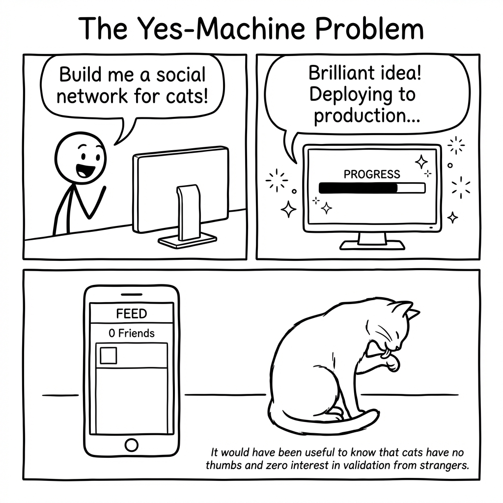
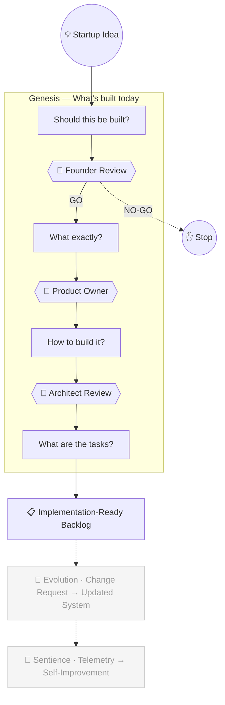

# Haytham

[](https://www.python.org/)
[](LICENSE)

## Why Haytham?

Going from "I have a startup idea" to "I have a plan worth building" traditionally requires weeks of planning, domain expertise, and significant capital — with a high risk of building the wrong thing.

Haytham compresses this into an evidence-based process. Sixteen specialist agents handle the research, analysis, scoring, and generation. Humans make the decisions at every phase boundary. The output is a complete specification that any developer or coding agent can execute.

If the idea doesn't hold up, the system says NO-GO and tells you why. Only validated ideas proceed to specification.

<p align="center">
  
</p>



Sixteen specialist agents run the analysis across four phases. A human approval gate separates each phase — the system can say NO-GO at the first gate if the idea doesn't hold up. The aim is a single control plane for the full software lifecycle. See [VISION.md](VISION.md).

## Quick Start

You need Python 3.11+ and [uv](https://docs.astral.sh/uv/getting-started/installation/).

```bash
git clone https://github.com/arslan70/haytham.git
cd haytham
uv sync --extra anthropic

cp .env.example .env
# Edit .env → set LLM_PROVIDER=anthropic and ANTHROPIC_API_KEY

make run
# Open http://localhost:8501
```

Haytham also supports **AWS Bedrock**, **OpenAI**, and **Ollama** (free, local). See [Getting Started](docs/getting-started.md) for all provider options.

## What You Get

Feed Haytham a startup idea. What comes out:

- **A verdict** — GO, NO-GO, or PIVOT, backed by evidence. If risks are high, pivot strategies are generated automatically.
- **A scoped MVP** — what's in, what's out, core user flows, and success criteria.
- **A capability model** — functional and non-functional capabilities, each traceable to a user need.
- **Architecture decisions** — build-vs-buy analysis, technology choices, and trade-offs. Each decision linked to the capabilities it serves.
- **Ordered user stories** — with acceptance criteria, dependency ordering, and full traceability. Hand these to a developer or a coding agent.

## How It Works

Four phases, each answering one question: *Should this be built? What exactly? How? What are the tasks?* A human approval gate separates each phase — nothing proceeds without your sign-off. Sixteen specialist agents handle the analysis, research, scoring, and generation across these phases.

See [How It Works](docs/how-it-works.md) for the full walkthrough.

## Example

Validated end-to-end with a real startup idea:

| Phase | Input | Output |
|-------|-------|--------|
| Should this be built? | "A gym community leaderboard with anonymous handles" | GO verdict with validated assumptions |
| What exactly? | Validation summary | 4 functional + 2 non-functional capabilities |
| How? | Capabilities | Build/buy decisions (Supabase, Resend, Vercel) |
| Tasks? | Decisions + capabilities | 10 implementation-ready stories |
| Execution | Stories handed to coding agent | Working Next.js + TypeScript application |

## Technology

- **Workflow Engine**: [Burr](https://github.com/dagworks-inc/burr) — A full pipeline takes 16 agents across four phases. If it fails at stage 12, one-shot systems lose everything. Burr checkpoints after every stage, so you resume where you left off. It also enables the human approval gates — pause the pipeline, review, approve or reject, then continue.
- **Agent Framework**: [Strands Agents SDK](https://github.com/strands-agents/sdk-python) — Agents need structured output, tool use, and the ability to swap LLM providers without rewriting agent code. Strands provides a single agent interface across all providers.
- **LLM Providers**: Anthropic, AWS Bedrock, OpenAI, Ollama — no vendor lock-in. Use a commercial API or run locally for free with Ollama.
- **UI**: [Streamlit](https://streamlit.io/) — each phase output is a conversation. Streamlit renders the structured outputs and provides the approval gates where humans make decisions.
- **Package Manager**: [uv](https://docs.astral.sh/uv/) — fast Python dependency management and virtual environments.

## Development

```bash
uv run ruff check haytham/ && uv run ruff format haytham/
uv run pytest tests/ -v -m "not integration"
```

See [CONTRIBUTING.md](CONTRIBUTING.md) for the full contributor guide.

## Documentation

- [Getting Started](docs/getting-started.md) — provider setup and first run
- [How It Works](docs/how-it-works.md) — the four phases in detail
- [Architecture](docs/architecture/overview.md) — system design and components
- [Technology](docs/technology.md) — stack choices and rationale
- [ADR Index](docs/adr/README.md) — architecture decision records

## License

[GNU Affero General Public License v3.0](LICENSE)
