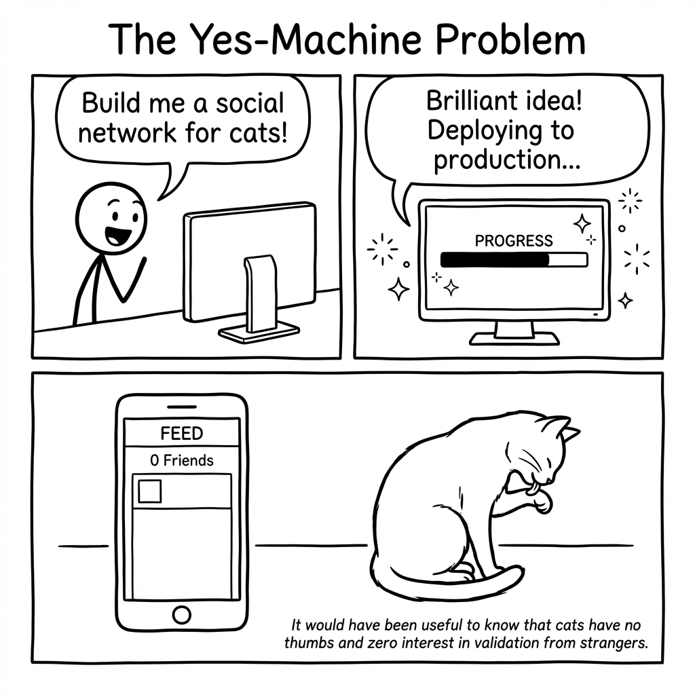

# Haytham

[](LICENSE)

Haytham is a Claude Code plugin that validates startup ideas and generates implementation-ready specifications. Specialist agents handle market research, competitor analysis, MVP scoping, architecture decisions, and specification generation. Humans make the decisions at every phase boundary. If the idea doesn't hold up, the system says NO-GO and tells you why.

<p align="center">
  
</p>

## Install

```
/plugin marketplace add arslan70/haytham
/plugin install haytham@haytham
```

No Python. No AWS credentials. No environment variables. Your existing Claude Code subscription handles everything.

## Usage

Run the full 4-phase workflow:

```
/haytham "a gym community leaderboard with anonymous handles"
```

Or run individual phases:

```
/haytham:validate "your idea"    # Phase 1: Should this be built?
/haytham:specify                 # Phase 2: What exactly?
/haytham:design                  # Phase 3: How to build it?
/haytham:plan                    # Phase 4: What are the specs?
```

## What You Get

Four phases, each answering one question:

| Phase | Question | Output |
|-------|----------|--------|
| Validate | Should this be built? | GO/NO-GO/PIVOT verdict backed by market research |
| Specify | What exactly? | MVP scope, capability model, system traits |
| Design | How to build it? | Build-vs-buy analysis, architecture decisions |
| Plan | What are the specs? | OpenSpec with SHALL requirements and Gherkin scenarios |

Every requirement traces to a capability, every capability to a validated need, every decision to the capabilities it serves.

Output is written to `.haytham/session/` and is produced as [OpenSpec](https://github.com/Fission-AI/OpenSpec) for use with any coding agent.

## Documentation

- [How It Works](https://arslan70.github.io/haytham/how-it-works/) - the four phases in detail
- [Getting Started](https://arslan70.github.io/haytham/getting-started/) - installation and first run
- [OpenSpec Output](https://arslan70.github.io/haytham/openspec-output/) - export format reference
- [System Evolution](https://arslan70.github.io/haytham/system-evolution/) - architectural lessons learned
- [Blog](https://arslan70.github.io/haytham/blog/) - posts on the design and development

## License

[GNU Affero General Public License v3.0](LICENSE)
