# Haytham

[](https://www.python.org/)
[](LICENSE)

## Why Haytham?

Going from "I have a startup idea" to "I have a plan worth building" traditionally requires weeks of planning, domain expertise, and significant capital — with a high risk of building the wrong thing.

Haytham compresses this into an evidence-based process. Specialist agents handle the research, analysis, scoring, and generation — some working individually, others coordinating in multi-agent swarms. Humans make the decisions at every phase boundary. The output is a complete specification that any developer or coding agent can execute.

If the idea doesn't hold up, the system says NO-GO and tells you why. Only validated ideas proceed to specification.

```mermaid
flowchart TD
    idea(("💡 Startup Idea"))

    idea --> P1

    subgraph genesis["Genesis — What's built today"]
        P1["Should this be built?"] -->|Validation Report| G1{{"👤 Founder Review"}}
        G1 -->|GO| P2["What exactly?"]
        P2 -->|MVP Spec| G2{{"👤 Product Owner"}}
        G2 -->|APPROVED| P3["How to build it?"]
        P3 -->|Architecture| G3{{"👤 Architect Review"}}
        G3 -->|APPROVED| P4["What are the tasks?"]
    end

    G1 -.->|NO-GO| stop(("✋ Stop"))
    P4 -->|Stories| backlog["📋 Implementation-Ready Backlog"]

    backlog -.-> evolution["🔮 Evolution · Change Request → Updated System"]
    evolution -.-> sentience["🔮 Sentience · Telemetry → Self-Improvement"]

    style evolution fill:#f5f5f5,stroke:#ccc,color:#999
    style sentience fill:#f5f5f5,stroke:#ccc,color:#999
```

<p align="center">
  
</p>



Specialist agents run the analysis across four phases. A human approval gate separates each phase — the system can say NO-GO at the first gate if the idea doesn't hold up. The aim is a single control plane for the full software lifecycle. See [VISION.md](VISION.md).

## Quick Start

You need Python 3.11+ and [uv](https://docs.astral.sh/uv/getting-started/installation/).

```bash
git clone https://github.com/arslan70/haytham.git
cd haytham
uv sync --extra bedrock

cp .env.example .env
# Edit .env → set LLM_PROVIDER=bedrock and configure AWS credentials

make run
# Open http://localhost:8501
```

Haytham also supports **AWS Bedrock**, **OpenAI**, and **Ollama** (free, local). See [Getting Started](docs/getting-started.md) for all provider options.

> **Note:** Haytham has been primarily tested with **AWS Bedrock**. Other providers should work but may have rough edges. Please [open an issue](https://github.com/arslan70/haytham/issues) if you hit problems with a specific provider.

## What You Get

Feed Haytham a startup idea. What comes out:

- **A verdict** — GO, NO-GO, or PIVOT, backed by evidence. If risks are high, pivot strategies are generated automatically.
- **A scoped MVP** — what's in, what's out, core user flows, and success criteria.
- **A capability model** — functional and non-functional capabilities, each traceable to a user need.
- **Architecture decisions** — build-vs-buy analysis, technology choices, and trade-offs. Each decision linked to the capabilities it serves.
- **Ordered user stories** — with acceptance criteria, dependency ordering, and full traceability. Hand these to a developer or a coding agent.

## How It Works

Four phases, each answering one question: *Should this be built? What exactly? How? What are the tasks?* A human approval gate separates each phase — nothing proceeds without your sign-off. See [How It Works](docs/how-it-works.md) for the full walkthrough.

## Example

Validated end-to-end with a real startup idea:

| Phase | Input | Output |
|-------|-------|--------|
| Should this be built? | "A gym community leaderboard with anonymous handles" | GO verdict with validated assumptions |
| What exactly? | Validation summary | 4 functional + 2 non-functional capabilities |
| How? | Capabilities | Build/buy decisions (Supabase, Resend, Vercel) |
| Tasks? | Decisions + capabilities | 10 implementation-ready stories |
| Execution | Stories handed to coding agent | Working Next.js + TypeScript application |

## Technology

[Burr](https://github.com/dagworks-inc/burr) (workflow engine), [Strands Agents SDK](https://github.com/strands-agents/sdk-python) (agent framework), [Streamlit](https://streamlit.io/) (UI), [uv](https://docs.astral.sh/uv/) (package manager). Supports Anthropic, AWS Bedrock, OpenAI, and Ollama — no vendor lock-in. See [Technology](docs/technology.md) for the full rationale.

## Development

```bash
uv run ruff check haytham/ && uv run ruff format haytham/
uv run pytest tests/ -v -m "not integration"
```

See [CONTRIBUTING.md](CONTRIBUTING.md) for the full contributor guide.

## Documentation

- [Getting Started](docs/getting-started.md) — provider setup and first run
- [How It Works](docs/how-it-works.md) — the four phases in detail
- [Architecture](docs/architecture/overview.md) — system design and components
- [Technology](docs/technology.md) — stack choices and rationale
- [ADR Index](docs/adr/index.md) — architecture decision records
- [Roadmap](docs/roadmap.md) — what's next
- [Troubleshooting](docs/troubleshooting.md) — common issues and debugging

## License

[GNU Affero General Public License v3.0](LICENSE)
