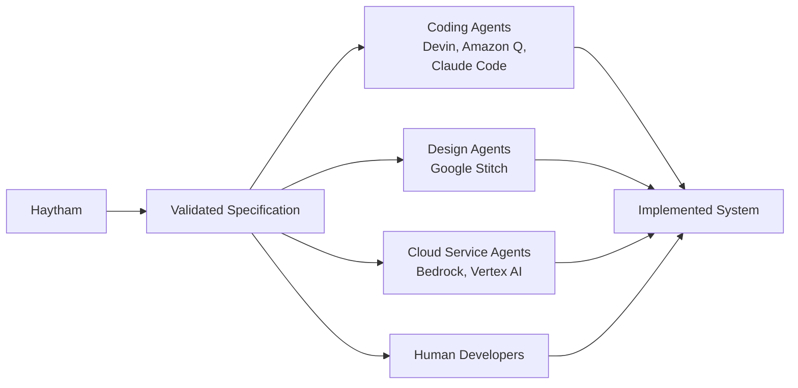

# VISION.md — The Haytham Roadmap

## Executive Summary

Haytham is a specification-driven control plane for software systems.

It turns a business intent into a validated specification — traced capabilities, architecture decisions, ordered stories — and then orchestrates execution agents to build and maintain the result. The specification is the differentiator: it gives every downstream agent (a hosted coding agent, a cloud provider's service agent, an MCP-native tool) the context to act with purpose rather than guess.

The journey has three milestones:

| Milestone | Name | Input | Output | Status |
|-----------|------|-------|--------|--------|
| M1 | **Genesis** | A startup idea | A validated, implementation-ready specification | IN PROGRESS |
| M2 | **Evolution** | System + change request | Updated system with full traceability | PLANNED |
| M3 | **Sentience** | Running system + telemetry | Continuous autonomous improvement | VISION |

Each milestone builds on the last. Without Genesis, Evolution has nothing to evolve. Without Evolution, Sentience has nothing to observe.

---

## Milestone 1: Genesis

**From idea to implementation-ready specification — then to a working system.**

Going from "I have an idea" to "I have a plan worth executing" traditionally requires weeks of planning, a team of specialists, significant capital, and a high risk of building the wrong thing.

Haytham compresses this into a structured, evidence-based process:

1. **Validate** — Is this idea worth building?
2. **Specify** — What exactly should the MVP include?
3. **Design** — How should each capability be built?
4. **Plan** — What are the implementation tasks?
5. **Execute** — Hand stories to coding agents for implementation
6. **Verify** — Validate implemented capabilities against the specification

Each phase is staffed by specialist AI agents. Each phase produces reviewable, structured output. Each phase ends with a human approval gate.

The output of Phases 1–4 is a complete specification: validated assumptions, scoped MVP, architecture decisions, and ordered user stories. This specification is not just documentation — it is the execution context that Phases 5–6 feed to coding agents, design agents, and service agents to produce a working system.

### Current State

Phases 1–4 are implemented and validated. The system was proven end-to-end with a real startup idea ("a gym community leaderboard with anonymous handles") that produced 10 implementation-ready stories, which were then executed into a working Next.js application.

### What Remains

- **Phase 5 (Implementation)**: Stories are dispatched to coding agents (Devin, Amazon Q Developer Agent, Claude Code, or any agent that accepts structured work items) for execution
- **Phase 6 (Validation)**: Implemented capabilities are validated against the specification

Genesis is complete when: idea in, working validated MVP out.

---

## Milestone 2: Evolution

**Systems evolve. Bugs appear. Requirements change.**

Software is never "done." After launch, users request features, bugs surface, requirements shift, and technical debt accumulates. Traditional development requires returning to an expensive, manual process for every change.

Haytham's traceability makes this tractable. Because every story traces to a capability, every capability to a need, and every decision to a rationale, the system can understand what exists and why — then generate targeted changes without a full rewrite.

When a change is needed, Haytham:

1. **Understands** the existing system from its specification
2. **Analyzes** the change request and its impact
3. **Generates** targeted stories (not a full rewrite)
4. **Implements** changes via coding agent
5. **Validates** against existing and new capabilities
6. **Ensures** no regression in existing functionality

### Examples

**"Add PDF export to reports"** — Haytham identifies the affected capability, analyzes the current architecture, recommends build-vs-buy for PDF generation, generates implementation stories, and validates that existing report functionality is unchanged.

**"Login fails on Safari"** — Haytham traces the issue to the authentication capability, retrieves the implementation context, diagnoses the root cause, generates a fix story, and validates the fix across browsers.

**"Payment code is getting complex, refactor it"** — Haytham identifies the affected capabilities, proposes a refactoring approach, generates stories with clear before/after expectations, and validates that all payment functionality still works.

### Success Criteria

| Criteria | Target |
|----------|--------|
| Change turnaround | Feature request to deployed in hours, not weeks |
| Regression rate | Zero regressions introduced |
| Traceability | Every change linked to its requirement and rationale |

---

## Milestone 3: Sentience

**The system improves itself.**

Even with Evolution, humans must notice that something needs to change, articulate what they want, and initiate the process. This is reactive, not proactive.

Sentience closes the final loop. The system monitors its own production behavior and autonomously proposes improvements:

- **Detect** — Monitor error rates, usage patterns, performance metrics, and business KPIs
- **Analyze** — Correlate signals with capabilities, code paths, and recent changes
- **Propose** — Generate improvement stories with evidence and expected impact
- **Execute** — Implement changes within approved policy bounds
- **Validate** — Confirm the improvement achieved its goal

### Approval Policies

Not all changes should be autonomous. Sentience operates within configurable policies:

| Change Type | Default Policy |
|-------------|----------------|
| Bug fixes (no feature change) | Auto-approve |
| Performance optimization | Auto-approve if tests pass |
| Security patches | Auto-approve |
| New features | Human approval required |
| UX changes | Human approval required |

Policies are configurable. The system earns autonomy through demonstrated reliability.

---

## The Control Plane: Orchestrating Execution Agents

Software is entering an era where the unit of execution is no longer just code — it's an agent. Hosted coding agents (Devin, Amazon Q Developer Agent, Google Jules, Claude Code), design agents (Google Stitch), and cloud-native service agents (AWS Bedrock Agents, Google Vertex AI Agents, Azure AI Agent Service) are proliferating. MCP is establishing common ground for tool-use across providers.

The missing layer is the one above them: something that knows *what* should be built and *why*, and can dispatch traced, contextualized work to whichever agent is best suited to execute it.

That is Haytham's role. Not a generic agent router, but a **specification-driven control plane** that provides the business context, traceability, and approval gates that make agent execution meaningful.

### The Pattern in Practice

Haytham already has a concrete example. [Google Stitch](https://stitch.withgoogle.com/) exposes UI generation capabilities through an official MCP endpoint (`stitch.googleapis.com/mcp`). Rather than generating code that calls a design API, Haytham's `ux_designer` agent connects to Stitch via the Strands `mcp_client` tool, discovers its available operations, generates UI screens for each capability, and extracts code in the architecture's chosen framework — all within a single agent turn.

The agent doesn't call a fixed API. It connects to a service that exposes tools, reasons about which tools to call and in what order, and adapts its approach based on the results. This is what "service as agent" looks like in practice: not a chatbot wrapper around an API, but an MCP-native service whose capabilities are discoverable and composable by any agent that speaks the protocol.

The same pattern extends to every execution boundary. The specification is the common interface — whether the executor is an agent or a human, they receive the same traced context:

### Why This Isn't Just Another Orchestration Framework

Generic orchestrators (LangGraph, CrewAI, AutoGen) route messages between agents. They solve the *plumbing* problem. Haytham solves a different problem: **what should the agents be doing, and how do we know they did it right?**

- **Specification first.** Agents receive validated, scoped work items — not open-ended instructions. A coding agent implementing a story knows the capability it serves, the architecture decisions that constrain it, and the acceptance criteria it must satisfy.
- **Traceability throughout.** Whether a capability is implemented by generated code, a hosted coding agent, or a cloud service agent, the traceability chain (story → capability → decision → rationale) is preserved. This is what makes Evolution and Sentience possible.
- **Human gates at phase boundaries.** Agents execute within human-approved scope. The founder approves the business case. The product owner approves the MVP scope. The architect approves the technical decisions. Only then do execution agents receive work.

### Why APIs Aren't Enough

APIs enforce rigid contracts. When you call `POST /provision`, the interface is fixed: structured input, predictable output, predetermined error codes. This works well for defined operations — and it should stay that way. Financial transactions, authentication, data integrity — these *must* be deterministic. Non-determinism in these domains is a bug.

But APIs struggle at integration boundaries where the real world leaks in. "Provision infrastructure that handles our expected load at minimum cost" involves trade-offs that no fixed endpoint can capture. "Generate a UI that matches our brand for this capability" requires interpretation, not a schema. "Refactor the payment module to support subscriptions" requires understanding the existing system, the business intent, and the downstream impact — context that a REST call cannot carry.

Today, we bridge this gap with orchestration glue: complex workflows built on top of deterministic APIs to approximate the reasoning that an agent does naturally. The glue is brittle, expensive to maintain, and breaks every time the world changes in a way the contract didn't anticipate.

The shift isn't *from* APIs *to* agents. It's recognizing that the world has two kinds of operations:

| | Defined Operations | Reasoning Operations |
|---|---|---|
| **Contract** | Known, fixed schema | Requires interpretation |
| **Inputs** | Structured, predictable | Context-dependent, ambiguous |
| **Execution** | Deterministic | Involves trade-offs and adaptation |
| **Best served by** | APIs | Agents |
| **Examples** | Insert a row, send an email, charge a card | Choose infrastructure, generate UI, plan a refactor |

Software systems involve both kinds of operations. The mistake is forcing reasoning operations into deterministic contracts. The agents proliferating today — coding agents, design agents, cloud service agents — exist precisely because the industry is recognizing where reasoning is needed.

Haytham operates at the layer where this distinction matters most: the boundary between business intent and technical execution. The specification it produces converts reasoning operations (what should we build, why, how) into a form that downstream agents — whether they reason or execute deterministically — can act on with full context.

### Implications per Milestone

- **Genesis** already benefits. Phase 5 dispatches stories to coding agents with full specification context. Phase 6 validates the result against the capability model. The spec isn't just documentation — it's the execution contract.
- **Evolution** benefits most immediately. Instead of generating integration code for every change, Haytham can delegate to service agents that already understand their domain. A "switch from email to SMS notifications" change request becomes a delegation from one communication service agent to another, with Haytham maintaining the traceability.
- **Sentience** becomes tractable. A self-improving system that can negotiate directly with infrastructure agents to optimize costs, scale resources, or rotate failing dependencies is more plausible than one that must generate, test, and deploy code for every operational adjustment.

This is not a bet that the industry will converge on a single agent protocol or that every service will expose an agent. It's a recognition that as execution agents proliferate, the value shifts to the layer that provides specification, traceability, and governance. That layer is Haytham.

---

## Principles for the Journey

### Close the Loop

Every phase must complete a feedback loop. Partial solutions have no value.

- Validation without implementation = speculation
- Implementation without validation = hope
- Observation without action = data hoarding

### Trust Is Earned

Autonomy expands gradually as the system proves reliable:

- **Genesis**: Human approves all major decisions
- **Evolution**: Human approves changes, system executes
- **Sentience**: System proposes and executes within policy bounds

### Trace Everything

Every artifact traces to its origin: story to capability, implementation to story, test to capability, change to requirement. Traceability enables Evolution and Sentience. Without it, the system becomes a black box.

### Stay Lean

Build the minimum viable version of each capability. Resist gold-plating, premature optimization, and over-abstraction. Before any work, ask: Does this advance the next milestone? Is this the minimum viable implementation? Does this close a loop or leave it open?
