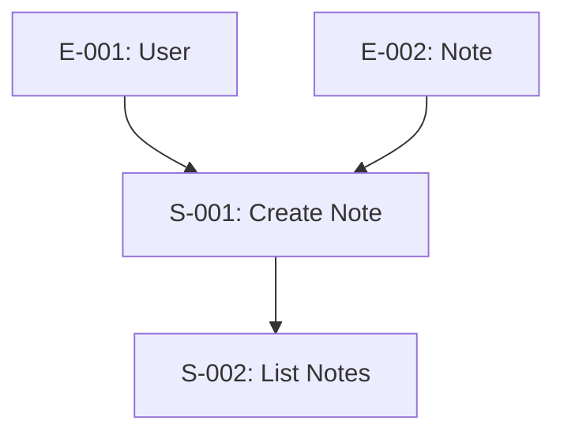

# ADR-001a: MVP Specification Enhancement

**Status**: Proposed
**Date**: 2025-01-02
**Parent**: [ADR-001: Story-to-Implementation Pipeline](./ADR-001-story-to-implementation-pipeline.md)
**Scope**: Enhancing MVP Specification output format for downstream processing

---

## POC Simplifications

- **ID Scheme**: Only 4 core IDs used throughout the system:
  - `S-XXX` for stories (replaces F-XXX)
  - `E-XXX` for entities
  - `T-XXX` for tasks
  - `D-XXX` for decisions
- **Nested Properties**: Acceptance criteria, ambiguities, uncertainties are properties of stories (not separate IDs)
- **Test Case**: Simple Notes App examples throughout
- **No Diagrams**: Mermaid/ASCII diagrams are optional, not required for machine processing
- **Generic Types Only**: Entity attributes use basic types (`String`, `Integer`, `DateTime`, `Boolean`, `Text`, `UUID`)
- **Implementation**: Modify existing `worker_mvp_specification` agent prompt (no new agent)

---

## Current MVP Spec Analysis

The existing `mvp_specification` stage outputs to `session/mvp-specification/mvp_specification.md`. Analysis of current format:

**What it has:**
- ✅ User stories with acceptance criteria (Given/When/Then)
- ✅ P0/P1/P2 prioritization
- ✅ Data requirements (prose form)
- ✅ UI/UX notes
- ✅ Success metrics

**What it lacks (needed for pipeline):**
- ❌ Story IDs (S-001, S-002) — currently no IDs
- ❌ Entity extraction — prose only ("Workout data from gym equipment")
- ❌ Dependency graph — implicit relationships only
- ❌ Uncertainty markers — ambiguities not flagged

**Decision**: Modify the existing `worker_mvp_specification` agent prompt to output the enhanced format. The agent will:
1. Assign IDs to stories (S-001, S-002, etc.)
2. Extract entities from data requirements (E-001, E-002, etc.)
3. Identify story dependencies
4. Flag uncertainties that need user clarification

---

## Context

The MVP Specification stage currently produces a human-readable document containing:
- Differentiation analysis
- MVP scope definition (P0/P1/P2 prioritization)
- User stories with acceptance criteria (Given/When/Then format)
- UI/UX notes
- Data requirements (prose)
- User journey map
- Feature specifications
- Success metrics

This format is designed to be **domain-agnostic** — it works for any startup idea (social networks, SaaS tools, marketplaces, hardware companions, etc.).

### Current Format Assessment

**Strengths:**
- Well-structured for human comprehension
- User stories follow standard Given/When/Then format
- Clear prioritization (P0/P1/P2)
- Includes acceptance criteria

**Gaps for Downstream Processing:**

| Gap | Example | Impact on Downstream |
|-----|---------|---------------------|
| No explicit entity model | "User data from the system" | Interpretation must infer data structures |
| Vague integration points | "Integrates with external services" | Cannot determine API surface |
| Implicit user roles | Stories mention personas without explicit permissions | No explicit permission model |
| No dependency graph | Features listed independently | Cannot determine build order |
| No uncertainty markers | Ambiguities hidden in prose | Silent assumptions instead of escalation |
| No technical constraints | Nothing about latency, scale, security | Defaults may not match user expectations |
| Prose data requirements | "Historical activity data" | Must parse natural language for schema |

### Problem Statement

The current MVP specification format requires significant interpretation effort by downstream stages. This interpretation:
1. May introduce inconsistent assumptions across chunks
2. Cannot distinguish between intentional omissions and overlooked details
3. Provides no structured hooks for machine processing
4. Forces downstream stages to re-parse prose for structured information

---

## Decision

Enhance the MVP Specification format with **structured sections** that complement (not replace) human-readable content. The enhanced format will include:

1. **Explicit Domain Model** — Entities, attributes, relationships
2. **User Roles & Permissions** — Who can do what
3. **Feature Dependency Graph** — Build order constraints
4. **Integration Point Inventory** — External systems and their interfaces
5. **Uncertainty Registry** — Explicit "TBD" items requiring decisions
6. **Non-Functional Hints** — Performance, security, scale expectations
7. **Story Enrichment** — Additional structured metadata per story

All sections use **generic templates** that apply to any domain.

---

## Enhanced Format Specification

### Section 1: Domain Model (NEW)

Extracts the core data entities from user stories and makes them explicit.

**Template:**

```markdown
## Domain Model

### Entities

#### Entity: [EntityName]
- **Description**: [What this entity represents]
- **Attributes**:
  | Attribute | Type | Required | Description |
  |-----------|------|----------|-------------|
  | id | UUID | Yes | Unique identifier |
  | [attr_name] | [Type] | [Yes/No] | [Description] |
  | ... | ... | ... | ... |
- **Relationships**:
  - [relationship_type]: [OtherEntity] ([cardinality])
  - ...

### Entity Relationship Diagram

```mermaid
erDiagram
    [EntityA] ||--o{ [EntityB] : [relationship]
    [EntityB] ||--o{ [EntityC] : [relationship]
    ...
```
```

**Type Vocabulary:**
- Primitives: `UUID`, `String`, `Text`, `Integer`, `Float`, `Boolean`, `DateTime`, `Date`, `Time`
- Complex: `JSON`, `Enum([values])`, `Reference([Entity])`
- Collections: `List[Type]`, `Set[Type]`

**Relationship Types:**
- `belongs_to` (many-to-one)
- `has_one` (one-to-one)
- `has_many` (one-to-many)
- `has_many_through` (many-to-many via join)

---

### Section 2: User Roles & Permissions (NEW)

Defines who can perform what actions on which resources.

**Template:**

```markdown
## User Roles & Permissions

### Roles

| Role | Description | Scope |
|------|-------------|-------|
| [RoleName] | [What this role represents] | [What data they can access] |
| ... | ... | ... |

### Permission Matrix

| Role | [Entity1] | [Entity2] | [Entity3] | ... |
|------|-----------|-----------|-----------|-----|
| [Role1] | CRUD | R | - | ... |
| [Role2] | CR | R | CRUD | ... |
| System | R | RU | R | ... |

**Legend**: C=Create, R=Read, U=Update, D=Delete, -=No Access

### Permission Notes
- [Any clarifications about permission boundaries]
- [Data isolation rules]
- [Special cases]
```

---

### Section 3: Story Dependency Graph (NEW)

Defines which stories depend on others, enabling build order planning.

**Template:**

```markdown
## Story Dependency Graph

### Dependencies

| Story ID | Story Name | Depends On | Dependency Type | Notes |
|----------|------------|------------|-----------------|-------|
| S-001 | [Name] | E-001 | Data | Requires entity |
| S-002 | [Name] | S-001, E-001 | Story, Data | Needs both |

**Dependency Types:**
- `Data`: Requires certain entities to exist
- `Story`: Requires another story's functionality

### Build Order Diagram


```

**Example (Notes App):**

```markdown
## Story Dependency Graph

| Story ID | Story Name | Depends On | Notes |
|----------|------------|------------|-------|
| S-001 | Create Note | E-001, E-002 | Foundation story |
| S-002 | List Notes | E-001, E-002 | Can run parallel with S-001 |
| S-003 | Search Notes | S-002 | Needs list first |
| S-004 | Delete Note | S-002 | Needs list first |
```

---

### Section 4: Integration Point Inventory (DEFERRED)

**POC Status**: Deferred. Most POC apps don't require external integrations. If integrations are needed, they can be captured as prose in the data requirements section.

**Future**: Will catalog external systems (APIs, webhooks) with structured metadata.

---

### Section 5: Uncertainty Registry (NEW)

Tracks ambiguities and pending decisions as properties of stories.

**Template:**

```markdown
## Uncertainty Registry

Uncertainties are tracked within each story's metadata:

| Story ID | Question | Category | Classification | Default |
|----------|----------|----------|----------------|---------|
| S-001 | [Question] | UX/Data/Business | Decision Required / Auto-Resolvable | [Default] |

**Categories:** UX, Data, Business, Security

**Classifications:**
- `Decision Required`: User must choose (high impact)
- `Auto-Resolvable`: Use default unless user objects (low impact)
```

**Example (Notes App):**

```markdown
## Uncertainty Registry

| Story ID | Question | Category | Classification | Default |
|----------|----------|----------|----------------|---------|
| S-001 | Max note length? | Data | Auto-Resolvable | 10,000 chars |
| S-003 | Search in title only or content too? | UX | Decision Required | - |
| S-004 | Soft delete or hard delete? | Data | Decision Required | - |
```

---

### Section 6: Non-Functional Requirements (NEW)

Captures expectations that aren't features but constrain implementation.

**Template:**

```markdown
## Non-Functional Requirements

### Performance Expectations

| Aspect | Expectation | Context | Priority |
|--------|-------------|---------|----------|
| [Operation] response time | [Target] | [Under what conditions] | P0/P1/P2 |
| Concurrent users | [Number] | [Scope - per tenant, total, etc.] | P0/P1/P2 |
| Data volume | [Amount] | [Time period, growth expectations] | P0/P1/P2 |
| ... | ... | ... | ... |

### Security Requirements

| Requirement | Priority | Notes |
|-------------|----------|-------|
| Authentication | P0/P1/P2 | [Method if known, or TBD] |
| Authorization | P0/P1/P2 | [Model - RBAC, ABAC, etc.] |
| Data encryption | P0/P1/P2 | [At rest, in transit, both] |
| [Domain-specific] | P0/P1/P2 | [Details] |
| ... | ... | ... |

### Reliability & Availability

| Aspect | Expectation | Notes |
|--------|-------------|-------|
| Uptime target | [Percentage or description] | [MVP vs long-term] |
| Data backup | [Frequency/policy] | [What data, retention] |
| Disaster recovery | [Expectation] | [RTO/RPO if known] |

### Constraints

| Constraint | Reason | Impact |
|------------|--------|--------|
| Must run locally | [Why] | [What this limits] |
| No external APIs | [Why] | [What this limits] |
| [Other constraints] | [Why] | [Impact] |
```

---

### Section 7: Story Enrichment (ENHANCED)

Each user story includes structured metadata for traceability.

**Template:**

```markdown
## Story: [Story Name]

### Metadata
- **Story ID**: S-[XXX]
- **Priority**: P0/P1/P2
- **Depends On**: [List of S-XXX or E-XXX]
- **Estimated Complexity**: Low/Medium/High

### User Story
As a [role], I want [capability] so that [benefit].

### Acceptance Criteria
- [ ] Given [precondition], when [action], then [result]
- [ ] Given [precondition], when [action], then [result]

### UI/UX Notes
- [Visual/interaction requirements]

### Data Requirements
- **Reads**: [List of entities read]
- **Writes**: [List of entities created/updated]
```

**Example (Notes App):**

```markdown
## Story: Create Note

### Metadata
- **Story ID**: S-001
- **Priority**: P0
- **Depends On**: E-001 (User), E-002 (Note)
- **Estimated Complexity**: Low

### User Story
As a user, I want to create a new note so that I can capture my thoughts.

### Acceptance Criteria
- [ ] Given I am logged in, when I click "New Note", then a blank note editor opens
- [ ] Given I have entered content, when I click "Save", then the note is persisted
- [ ] Given I save a note, when I view my notes list, then the new note appears

### UI/UX Notes
- New Note button prominently displayed
- Auto-save after 2 seconds of inactivity

### Data Requirements
- **Reads**: User (for ownership)
- **Writes**: Note (create new)
```

---

## Complete Enhanced Structure

```
MVP Specification for [Product Name]
│
├── Differentiation Analysis (existing)
│
├── Domain Model (NEW)
│   ├── Entities with attributes and relationships (E-XXX)
│   └── Entity Relationship Diagram (Mermaid)
│
├── User Roles & Permissions (NEW)
│   ├── Role definitions
│   └── Permission matrix
│
├── MVP Scope Definition (existing, enhanced)
│   ├── Core Value Statement
│   ├── In Scope (P0) - with Story IDs (S-XXX)
│   ├── Out of Scope (P1)
│   └── Out of Scope (P2+)
│
├── Story Dependency Graph (NEW)
│   ├── Dependency table
│   └── Build order diagram (Mermaid)
│
├── Uncertainty Registry (NEW)
│   ├── Open decisions (as story properties)
│   └── Classification criteria
│
├── User Journey Map (existing)
│
├── Story Specifications (existing, enhanced)
│   └── Each story includes:
│       ├── Metadata (S-XXX, priority, dependencies)
│       ├── User Story
│       ├── Acceptance Criteria
│       ├── UI/UX Notes
│       └── Data Requirements (structured)
│
└── Success Metrics (existing)
```

**Example for Notes App:**

```
MVP Specification for Simple Notes App
│
├── Domain Model
│   ├── E-001: User (id, email, name, created_at)
│   └── E-002: Note (id, title, content, user_id, created_at, updated_at)
│
├── User Roles & Permissions
│   └── User: CRUD on own notes only
│
├── MVP Scope (P0)
│   ├── S-001: Create Note
│   ├── S-002: List Notes
│   ├── S-003: Search Notes
│   └── S-004: Delete Note
│
├── Story Dependencies
│   └── S-001, S-002, S-003, S-004 all depend on E-001, E-002
│
└── Success Metrics
    └── User can create, find, and delete notes
```

---

## Implementation

### Changes to MVP Specification Agent

The `worker_mvp_specification` agent prompt must be updated to generate these additional sections. Key changes:

1. **Domain Model Extraction**: Analyze stories to identify entities and relationships
2. **Role Inference**: Extract user types from story personas
3. **Dependency Analysis**: Determine feature prerequisites
4. **Uncertainty Identification**: Flag ambiguous requirements with explicit markers
5. **Structured Output**: Generate both human-readable and machine-parseable sections

### Prompt Additions

The MVP Specification agent prompt should include instructions to:

```
## Additional Output Requirements

After generating the standard MVP specification, also produce:

1. DOMAIN MODEL
   - Extract all nouns that represent data entities from user stories
   - Assign each entity an ID (E-001, E-002, etc.)
   - For each entity, list attributes mentioned or implied
   - Identify relationships between entities
   - Output as structured table + Mermaid ERD

2. USER ROLES
   - Extract all user types/personas mentioned in stories
   - Infer permissions from story actions (who does what to what)
   - Output as role-permission matrix (CRUD per entity)

3. STORY DEPENDENCY GRAPH
   - Assign each story an ID (S-001, S-002, etc.)
   - Analyze which stories require others to function
   - Identify data dependencies (which entities must exist first)
   - Output as dependency table + Mermaid graph

4. UNCERTAINTY REGISTRY
   - Flag any requirement that is ambiguous or underspecified
   - Associate each uncertainty with its story ID
   - Classify as "Decision Required" or "Auto-Resolvable"
   - Provide sensible default for auto-resolvable items

5. For each STORY, add structured metadata:
   - Story ID (S-XXX)
   - Dependencies (list of S-XXX or E-XXX)
   - Data requirements (Reads/Writes by entity)
   - Acceptance criteria as a list
```

### Validation Rules

The enhanced MVP specification should be validated for:

| Rule | Description | Severity |
|------|-------------|----------|
| Entity Completeness | Every entity referenced in stories appears in Domain Model | Error |
| Role Coverage | Every persona in stories appears in Roles | Error |
| Dependency Acyclicity | No circular dependencies in story graph | Error |
| Story ID Uniqueness | No duplicate S-XXX IDs | Error |
| Entity ID Uniqueness | No duplicate E-XXX IDs | Error |
| Relationship Validity | All relationship targets exist in entity list | Error |

### ID Schemes

| Entity Type | Format | Example |
|-------------|--------|---------|
| Story | S-XXX | S-001, S-002, S-015 |
| Entity | E-XXX | E-001, E-002 |
| Task | T-XXX | T-001, T-002 |
| Decision | D-XXX | D-001, D-002 |

**Nested within stories (no separate IDs):**
- Acceptance criteria: `S-001.ac[0]`, `S-001.ac[1]`
- Ambiguities: `S-001.ambiguities[0]`
- Uncertainties: property of story or entity

IDs should be assigned sequentially and never reused within a specification.

---

## Consequences

### Positive

1. **Reduced Interpretation Burden**: Downstream stages receive structured data
2. **Explicit Uncertainties**: Ambiguities surfaced rather than assumed
3. **Build Order Clarity**: Dependency graph enables sequenced implementation
4. **Traceability Foundation**: IDs enable linking stories → tasks → code
5. **Consistent Entity Model**: Single source of truth for data structures
6. **Domain Agnostic**: Format works for any type of product

### Negative

1. **Increased Specification Length**: Document grows significantly (~2-3x)
2. **Agent Complexity**: MVP Specification agent must do more analysis
3. **Potential Over-Specification**: May constrain creative solutions
4. **Learning Curve**: Users must understand new sections

### Risks

| Risk | Likelihood | Impact | Mitigation |
|------|------------|--------|------------|
| Domain Model Accuracy | Medium | High | Human review gate, iterative refinement |
| False Precision | Medium | Medium | Uncertainty registry acknowledges unknowns |
| Agent Hallucination | Low | High | Validation rules catch inconsistencies |
| User Overwhelm | Medium | Medium | Collapsible sections, summary views |

---

## Alternatives Considered

### Alternative 1: Separate Analysis Stage

Instead of enhancing MVP spec, add a separate "Specification Analysis" stage that produces structured data from the existing prose format.

**Rejected because**:
- Duplicates parsing effort
- Analysis stage would make same inferences MVP agent could make
- Single integrated document is easier to review
- Two documents can drift out of sync

### Alternative 2: Minimal Enhancement (Uncertainty Registry Only)

Only add uncertainty markers, keep everything else as prose.

**Rejected because**:
- Doesn't address entity model gap
- Dependency analysis still required downstream
- Misses opportunity to provide build order
- Incomplete solution to the interpretation problem

### Alternative 3: Machine-Only Format (JSON/YAML)

Generate purely structured format instead of markdown.

**Rejected because**:
- Loses human readability (violates requirement)
- User cannot easily review/modify
- Markdown with embedded structure provides both
- Harder to display in UI

### Alternative 4: Separate Human + Machine Documents

Generate two documents: one human-readable, one machine-readable.

**Rejected because**:
- Documents can drift out of sync
- Harder to maintain consistency
- User must review two documents
- Single source of truth is preferable

---

## Resolved Questions (POC)

1. **Mermaid Support**: ~~Require Mermaid or ASCII fallbacks?~~ → **No diagrams required for POC.** Entities listed as simple tables. Diagrams are nice-to-have, not essential for machine processing.

2. **Entity Attribute Types**: ~~How specific?~~ → **Generic types only** (`String`, `Integer`, `DateTime`, `Boolean`, `Text`, `UUID`). Semantic types (`Email`, `URL`) deferred.

3. **Partial Specifications**: ~~How handle incomplete sections?~~ → **Ask user to clarify.** If entities missing, prompt user. If stories missing, block. Don't proceed with incomplete data.

4. **Versioning**: ~~Include version number?~~ → **No.** Single state.json is overwritten. No version history for POC.

---

## Future Enhancements

- Mermaid ERD diagram generation
- Semantic attribute types (`Email`, `URL`, `PhoneNumber`)
- Spec versioning and change tracking
- Auto-inference of missing sections from context
- Validation that all referenced entities exist

---

## Next Steps

Upon approval:

1. Update `worker_mvp_specification` agent prompt with new output requirements
2. Add validation logic to MVP specification stage
3. Create template file that agent can reference
4. Add user review gate after MVP spec generation
5. Proceed to ADR-001c (System State Model) which consumes this enhanced format

---

## Related Documents

- [ADR-001: Story-to-Implementation Pipeline](./ADR-001-story-to-implementation-pipeline.md) (parent)
- [ADR-001c: System State Model](./ADR-001c-system-state-model.md) (consumes this format)
