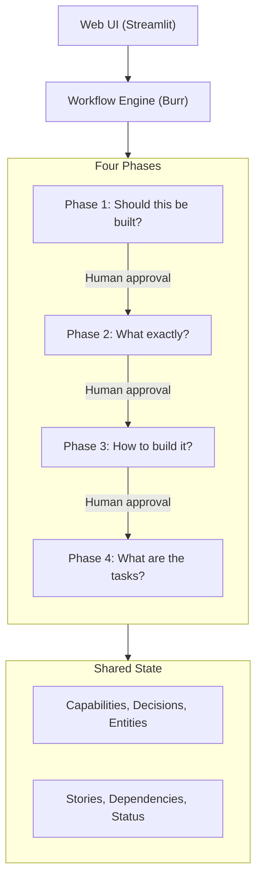

# Architecture Overview

This document describes how Haytham is built. For the user-facing process walkthrough, see [How It Works](../how-it-works.md). For details on each technology and why it was chosen, see [Technology Stack](../technology.md).

---

## System Design

Haytham is a multi-phase workflow system where:

- **Specialist AI agents** perform analysis and generation at each stage
- **Humans approve** at phase boundaries (gates)
- **Shared state** provides continuity across the entire lifecycle



## Core Components

### Workflow Engine

[Burr](https://github.com/dagworks-inc/burr) orchestrates the four phases as a state machine. Each stage runs in order, with conditional branches where needed (e.g., the pivot strategy stage only runs when risk is HIGH).

Key behaviors:
- **Checkpoint persistence.** Progress is saved after every stage. If the process is interrupted, it resumes where it left off.
- **Tracking UI.** An optional dashboard at `localhost:7241` shows which stages ran and what state was passed between them.

### Stage Registry

A central list of all stages: their names, which phase they belong to, and what order they run in. Adding a new stage means adding it here.

### Stage Executor

Runs a single stage. Every stage follows the same pattern: receive input from earlier stages, call an agent, save the output. The stages differ only in their configuration, not their execution logic.

### Agent Factory

Creates agents on demand using the [Strands Agents SDK](https://github.com/strands-agents/sdk-python). Each agent has a prompt file, a model tier, and optionally a schema for structured output. Adding a new agent means adding a config entry and a factory function.

### Session Manager

Saves everything to disk. Each stage writes its output to a folder under `session/`. When a full phase completes, it's locked so it won't accidentally re-run.

### Workflow Runner

Connects the workflow engine to the web UI. The engine runs asynchronously; the runner wraps it so Streamlit can display progress and collect approvals.

## Shared State

Two stores keep information flowing between phases:

| Store | What it holds | How it works |
|-------|---------------|-------------|
| **Vector database ([LanceDB](https://lancedb.github.io/lancedb/))** | Capabilities, architecture decisions, domain entities | Agents search it to find relevant context from earlier phases. Runs locally, no server needed. |
| **[Backlog.md](https://backlog.md/) (MCP)** | Stories, tasks, status | Where the generated stories live. Coding agents can read and update stories during implementation via [MCP](https://modelcontextprotocol.io/). |

### Nothing is overwritten

Capabilities and decisions are never modified. When requirements change, a new version is created that points back to the old one. This keeps a clear audit trail of what changed and why.

### Everything is linked

Every story links back to the rest of the system:

- `implements:CAP-F-001` - which capability this story delivers
- `uses:DEC-001` - which architecture decision it depends on
- `touches:ENT-001` - which domain entity it affects

This traceability is what makes the [Evolution milestone](../../VISION.md#milestone-2-evolution) possible. The system can understand what already exists and generate targeted changes instead of starting over.

## Why Separate Phases?

| Factor | Benefit |
|--------|---------|
| **Role alignment** | Each phase maps to a recognizable role (Founder, Product Owner, Architect, Tech Lead) |
| **Focused state** | Each phase manages only the state it needs |
| **Failure isolation** | Problems are contained to one phase |
| **Independent evolution** | Improve one phase without affecting others |
| **Natural pacing** | Days between phases is normal. No pressure to run end-to-end in one session |

## Agent Architecture

Each agent has three parts: a **prompt** (what it's told to do), a **model tier** (how capable the LLM needs to be), and optionally a **structured output schema** (what shape the response must take).

### Model Tiers

Not every agent needs the most powerful model. Agents are assigned to one of three tiers:

| Tier | When it's used | Examples |
|------|---------------|---------|
| **REASONING** | Complex analysis that requires weighing evidence | Validation scoring, risk assessment |
| **HEAVY** | Substantial writing or generation | Market analysis, architecture decisions, story generation |
| **LIGHT** | Quick classification or formatting | Idea polishing, input validation |

Each tier maps to a configurable model per provider, so you control the cost/quality trade-off.

### Structured Output

Most agents return structured data (scores, competitor lists, story skeletons) rather than free-form text. A schema defines exactly what fields the agent must return. The LLM is constrained to that schema, so the output is always valid and parseable. This structured data is saved as JSON for the workflow engine and converted to markdown for human review.

### The Control Plane Pattern

Haytham separates two concerns: **deciding what to build** (Phases 1-4) and **executing the build** (Phase 5+). The specification phases are Haytham's core. Execution is delegated to whatever agent or person is best suited — coding agents, design services, cloud service agents, or human developers. The workflow engine treats all of these the same way: same specification context, same approval gates, same traceability.

See [VISION.md](../../VISION.md#the-control-plane-orchestrating-execution-agents) for the full rationale and [Roadmap](../roadmap.md) for planned integrations (including [Google Stitch](https://stitch.withgoogle.com/) via [ADR-021](../adr/ADR-021-design-ux-workflow-stage.md)).

## Validation Pipeline

At the end of Phase 1, a three-step pipeline (scorer → narrator → merge) decides whether the idea is worth building, producing a GO / NO-GO / PIVOT verdict. See [Scoring Pipeline](scoring-pipeline.md) for full details.

## Project Structure

Simplified view of the codebase. The full package includes additional modules for context management, exporters, feedback, and more.

```
haytham/
├── agents/                  # Specialist AI agents
│   ├── factory/             # Creates agents on demand
│   └── worker_*/            # One folder per agent (prompt + config)
├── workflow/                # Workflow engine and stage definitions
├── session/                 # Saves progress and stage outputs to disk
├── state/                   # Tracks what's been produced and what's covered
├── formatters/              # Converts structured data to readable output
├── phases/                  # Configuration for each phase
└── telemetry/               # Optional tracing (OpenTelemetry)

frontend_streamlit/          # Web UI
├── Haytham.py               # Main dashboard
├── lib/                     # Workflow runner and helpers
├── views/                   # One view per workflow phase
├── components/              # Reusable UI pieces
└── assets/                  # Images and static files

tests/                       # Test suite
```
