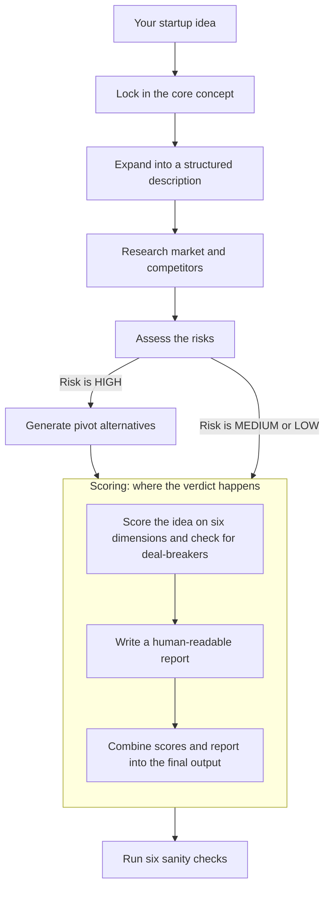

# Scoring & Validation Pipeline

The validation scoring pipeline is how Haytham decides whether a startup idea is worth building. After researching the market, competitors, and risks, this pipeline weighs all the evidence and produces a GO / NO-GO / PIVOT verdict. It runs in three steps: a **scorer** grades the idea on multiple dimensions, a **narrator** writes a human-readable report from those grades, and a **merge** step combines them into the final output.

> For a higher-level overview, see [How It Works: Phase 1](../how-it-works.md#phase-1-should-this-be-built).

## How the pieces fit together

## Scorer Agent

The scorer reads the full output from every step shown in the flowchart above (the concept description, market research, competitor analysis, risk assessment, and pivot strategy if one was generated). It builds a scorecard one step at a time. It works through five steps in order, each recording a piece of the final assessment.

### How the scorer works, step by step

| Step | What happens |
|------|-------------|
| Check deal-breakers | Is the problem real? Can you reach customers? Any legal or ethical blockers? If any one fails, the idea is rejected immediately. |
| Capture red flags | Record any evidence that argues against the idea. For each piece of bad news, note which scores it threatens and explain why those scores should (or shouldn't) change. |
| Score six dimensions | Rate the idea on six dimensions (listed below). Each score must be backed by specific evidence from an earlier stage, and the same evidence can't be reused for multiple scores. |
| Summarize risk | Record the overall risk level and how well the claims held up: how many were backed by outside sources, and whether any critical assumptions were contradicted. |
| Compute verdict | Add it all up. Apply penalties for unaddressed red flags, cap scores when risk is high, and produce the final GO / NO-GO / PIVOT recommendation with an overall score. |

### The six scored dimensions

- **Problem Severity** - How painful is the problem?
- **Market Opportunity** - How big is the market?
- **Competitive Differentiation** - What sets this apart?
- **Execution Feasibility** - Can this actually be built?
- **Revenue Viability** - Will people pay?
- **Adoption & Engagement Risk** - Will people switch to this?

### How evidence quality is checked

Before a dimension score is accepted, three checks run:

1. **No copy-pasting the rubric.** If the evidence just repeats the scoring criteria word-for-word (e.g., "users pay for workarounds today"), it's rejected. The scorer must cite actual findings, not parrot the grading scale.

2. **High scores need a source.** Any score of 4 or above must point to a specific earlier stage (market research, competitor analysis, risk assessment, etc.) that produced the evidence. You can't give a high score without saying where the proof came from.

3. **No double-dipping.** The same piece of evidence can't justify scores on two different dimensions. If two dimensions share more than 70% of the same wording, the second one is rejected. Each score needs its own distinct backing.

### How the verdict is computed

The scorer applies these rules in order to arrive at the final recommendation:

1. **Deal-breaker check.** If any of the three deal-breakers failed, the verdict is NO-GO immediately.
2. **Average the scores.** Add up all six dimension scores and divide by six.
3. **Weak-spot cap.** If any single dimension scored 2 or below, the average is capped at 3.0 no matter how high the others are. One serious weakness drags down the whole assessment.
4. **Red flag check.** If red flags were recorded against high-scoring dimensions, those red flags must be properly addressed with real evidence. Unaddressed red flags generate warnings.
5. **Red flag penalty.** Two or more warnings subtract 0.5 from the overall score.
6. **Map score to verdict.** 2.0 or below = NO-GO. Between 2.1 and 3.5 = PIVOT. Above 3.5 = GO.
7. **High-risk override.** If overall risk is HIGH, a GO verdict is downgraded to PIVOT unless at least two red flags were convincingly addressed.
8. **Confidence level.** Based on how much of the evidence was backed by outside sources and whether any critical assumptions were contradicted (see below).

### How confidence is determined

The system assigns a confidence level (HIGH, MEDIUM, or LOW) to the verdict based on evidence quality. Checked in this order, first match wins:

| Condition | Confidence |
|-----------|------------|
| Any critical assumption was contradicted by evidence | LOW |
| Risk is HIGH and less than half the claims have outside backing | LOW |
| Risk is HIGH but at least half the claims have outside backing | MEDIUM |
| Less than 40% of claims have outside backing | LOW |
| 40-69% of claims have outside backing | MEDIUM |
| 70%+ of claims have outside backing and risk is not HIGH | HIGH |

## Narrator Agent

After the scorer finishes grading, the narrator takes those scores and the original research, and writes the report a human will actually read: an executive summary, a Lean Canvas, key findings, and recommended next steps.

## Merge Step

The merge step combines the scorer's numbers (scores, deal-breaker results, red flags, verdict) with the narrator's written report into a single output. If the narrator accidentally states a different verdict than what the scorer computed, the merge step corrects the text to match the scorer's verdict. The scorer's numbers always win.

## Sanity Checks

After the verdict is produced, six automated checks look for internal inconsistencies:

| Check | What it catches |
|-------|----------------|
| Revenue evidence | Does the Revenue Viability score match the actual revenue evidence found? |
| Claim origins | Are the scores consistent with how many claims had outside backing? |
| Job-to-be-done match | Do the market research and competitor analysis agree on the core customer job? |
| Concept health | Are dimension scores properly capped when the concept health signals are weak? |
| Adoption inputs | Are the Adoption & Engagement Risk inputs (trigger confidence, switching cost) consistent with the score? |
| Market size sanity | Is the serviceable market estimate plausible relative to the total and addressable market sizes? |

## Where each dimension gets its evidence

| Dimension | Where the evidence comes from |
|-----------|-------------------------------|
| Problem Severity | Signs of pain from users, concept health signals, complaints in forums |
| Market Opportunity | Total/addressable/serviceable market sizes, industry reports, growth trends |
| Competitive Differentiation | Gaps in competitor offerings, how hard it is for users to switch, review site data |
| Execution Feasibility | Whether the technical and operational claims hold up |
| Revenue Viability | Evidence of existing revenue in the space, willingness to pay, pricing benchmarks |
| Adoption & Engagement Risk | How confident the trigger moment is, how hard current workarounds are, switching costs |

## Key files

| File | What it contains |
|------|-----------------|
| `haytham/agents/tools/recommendation.py` | Scoring tools, evidence checks, and verdict computation |
| `haytham/agents/worker_validation_scorer/worker_validation_scorer_prompt.txt` | The scorer agent's prompt |
| `haytham/agents/worker_validation_narrator/` | The narrator agent's prompt and output models |
| `haytham/agents/worker_validation_summary/validation_summary_models.py` | Data models, merge logic, and markdown rendering |
| `haytham/workflow/stages/idea_validation.py` | Orchestrates the scorer, narrator, and merge steps |
| `haytham/workflow/validators/` | The six sanity check implementations |
| `haytham/workflow/anchor_schema.py` | Data models for the concept anchor and founder context |
