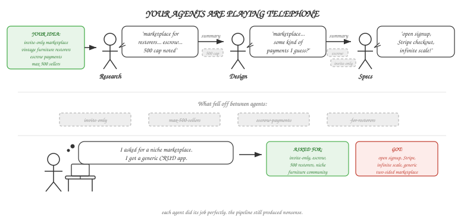

# Your Agents Are Playing Telephone



---

## The Case for Decomposition

There are good reasons to split a complex task across multiple agents. A single agent trying to research a market, design an architecture, and write specs all at once will hit context limits, lose focus, and give you no chance to review between phases.

Decomposition buys you three things: specialization (each agent does one thing well), decision gates (you review before the next phase runs), and cost control (change one phase without re-running everything).

So you split the work. Research agent, planning agent, design agent, implementation agent. Each one focused and manageable.

But give the pipeline a specific, nuanced input. Something like "build an invite-only marketplace for vintage furniture restorers, with escrow payments, max 500 sellers at launch." What comes out the other end is a generic two-sided marketplace with open signup, Stripe checkout, and infinite scalability. Every distinctive constraint, the things that made the input *yours*, got smoothed away by agents who each did their job perfectly in isolation.

This is the telephone game, except the players are LLMs and the message is your system.

<!-- more -->

## The Failure Modes Are Predictable

Build enough multi-agent pipelines and the same failure modes keep showing up. The most common is genericization: agents default to whatever dominates their training data. "Invite-only for restorers" becomes "open marketplace." "Max 500" disappears. This happens even when the constraints are right there in the prompt, because models actively drift toward training-data priors, treating your specific requirements as suggestions. Constraints expressed only in prose fare worse. We saw "build in 2 weeks" produce a 40-story backlog across 4 frameworks. The constraint was never enforced by the system, so no agent respected it.

Specific requirements also vanish through summarization. The "max 500 sellers" constraint was in paragraph three of one upstream output. By the planning agent, it's gone. Nobody notices because the output still *looks* complete.

Fabrication compounds the problem. Agent 3 invents a market size figure, marks it `[validated]`, and Agent 4 trusts it completely. A pipeline that treats hallucinations as upstream ground truth, then builds on them, is structurally worse than a single agent hallucinating. Each handoff adds confidence to claims that were never grounded.

Contradictions slip through just as quietly. Agent 2 says `auth: invite-only`. Agent 4 designs an open registration flow. Each agent validates against its own inputs, not its siblings. Both statements coexist peacefully in the final output.

The obvious fix is to ask agents "did you preserve the original requirements?" We tried. They always say yes. Subtle genericization doesn't register as an error to the model that produced it. "Open marketplace" and "invite-only marketplace" are both valid marketplaces. The model sees no contradiction because the drift is qualitative, not logical.

Kim et al. (2025) studied context preservation across multi-agent architectures and found only 34% context overlap after 10 interactions, with error amplification of 17.2x in independent agent setups. This isn't a bug in any specific system. It's a property of the architecture.

## Why It Happens

The root cause is deceptively simple: you're asking Agent N+1 to reconstruct meaning from Agent N's *output*, not from Agent N's *understanding*. Each handoff is a lossy compression. Stack enough of them and you get noise.

Four things make it worse:

**More agents, more telephone.** Every agent you add is another handoff, another lossy compression step. We've seen pipelines where merging two chatty agents into one, with a clearer prompt, produced better results than the "cleaner" decomposition. The right question isn't "can I split this?" It's "does this split justify the handoff cost?"

**Forced summarization.** A downstream agent rarely needs input from just one prior stage. It needs context from several. You can't concatenate five full outputs into a single prompt, both for cost and because context windows have limits. So you summarize. That's a legitimate engineering tradeoff, not a mistake. But summaries are lossy. Nuance is where your requirements live.

**Prose as protocol.** Most multi-agent systems pass information as natural language. Natural language is ambiguous by design. When Agent 2 reads "a marketplace for restorers," it doesn't know if "restorers" is a hard constraint or a rough suggestion. So it guesses. Usually wrong.

**LLMs love the median.** Given ambiguity, language models gravitate toward the most common pattern in their training data. Your specific requirements get pulled toward the center of the distribution, one agent at a time.

## What Actually Works

Here's what we landed on, after watching a lot of outputs get mangled.

### 1. Immutable Anchors

The obvious question: why not just pass the original input to every agent? Because raw input is ambiguous prose. Each agent will interpret "invite-only marketplace for vintage furniture restorers" differently. An anchor is different: you extract the key constraints once, early, into a small structured artifact. Pass it to every downstream agent, unchanged.

```yaml
anchor:
  goal: "invite-only marketplace for vintage furniture restorers"
  constraints:
    - "seller cap: 500 at launch"
    - "escrow payments, not direct checkout"
    - "invite-only onboarding"
  non_goals:
    - "open registration"
    - "general e-commerce"
```

Small. Immutable. Every agent gets it, none can modify it. Agents *respond* to the anchor; they don't rewrite it. This is the single biggest lever against genericization.

### 2. Structured Handoffs, Not Prose

When Agent N extracts a value, pass it as a structured input to Agent N+1. Don't embed it in a paragraph and hope the next agent extracts it correctly.

```python
def init_context(*, auth_model: str, seller_cap: int) -> None:
    """Pre-set values extracted by prior agents.
    Downstream agents use these directly."""
    if auth_model not in ("open", "invite-only", "waitlist"):
        raise ValueError(f"Invalid auth_model: {auth_model!r}")
    ctx = _new_context()
    ctx["auth_model"] = auth_model
    ctx["seller_cap"] = seller_cap
```

Treat agent inputs like function arguments. You wouldn't pass `auth_model` to a function by hiding it in a comment string. Don't do it with agents either.

### 3. Deterministic Rules Override LLM Text

This is the one people push back on, because it feels like you're not "trusting" the agent. Good. You shouldn't.

The LLM's job is qualitative judgment: evaluating trade-offs, assessing feasibility, writing prose. The system's job is enforcing hard rules derived from those judgments.

```python
# Budget constraint: if timeline is "2 weeks", cap requirements at 10
if timeline_weeks <= 2 and len(requirements) > MAX_REQUIREMENTS_SHORT:
    requirements = prioritize_and_trim(requirements, MAX_REQUIREMENTS_SHORT)
```

No agent can override this. One agent might write an ambitious plan with 40 stories. The system trims it to what fits the stated constraint. The code always wins.

Keep this boundary sharp. Every time you let LLM-generated text override a deterministic rule, you're adding another player to the telephone game.

### 4. Evidence Gates at Handoffs

Don't let agents make unsourced claims. If an agent says the market is growing at 15% CAGR, require it to cite where that number came from. If it rates feasibility as "high," require the evidence behind the rating. Reject outputs that parrot the prompt's rubric back at you without grounding.

Do this at the handoff boundary, not as a self-check (self-checks don't work, remember).

### 5. Validators Before State Entry

Run validators after an agent completes but *before* its output enters the pipeline state. This is where you catch contradictions: if Agent 2 decided `auth: invite-only` and Agent 4 outputs an open registration flow, a validator at the boundary flags the conflict before it cements. Without this, you discover three stages later that your spec describes a completely different product.

## What We Haven't Solved

You can't fix the telephone game by making agents smarter, and you definitely can't fix it by adding more agents. The fix is structural: fewer handoffs, immutable anchors, structured data at boundaries, deterministic rules that code enforces, evidence gates, and validators before state entry.

That gets you a long way. Kim et al.'s study found that centralized verification drops error amplification from 17.2x to 4.4x. Meaningful, but not zero.

The hardest remaining problem is forced summarization. When a downstream agent genuinely needs context from five prior stages, something has to give. We're experimenting with selective context injection (full output for the most relevant upstream stages, summaries for the rest), but we don't have a clean answer yet.

If you're building a multi-agent pipeline and hitting similar problems, start with immutable anchors. They're the smallest change with the biggest impact. We're working through these patterns in [Haytham](https://github.com/arslan70/haytham), an open-source multi-agent system, and the codebase shows what this looks like in practice.
