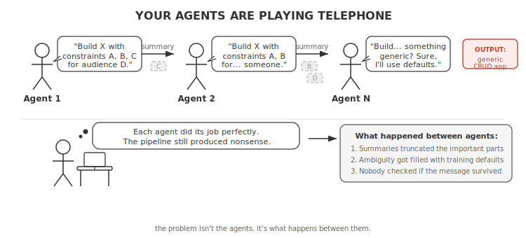

# Your Agents Are Playing Telephone

*By someone who has stared at too many multi-agent pipelines and has opinions about it.*

---



---

Here's a fun experiment. Give a multi-agent pipeline a specific, nuanced input. Something like "build an invite-only marketplace for vintage furniture restorers, with escrow payments, max 500 sellers at launch." Run it through five or six agents. Look at what comes out.

What you'll get is a generic two-sided marketplace with open signup, Stripe checkout, and infinite scalability. Every distinctive constraint, the things that made the input *yours*, got smoothed away by agents who each did their job perfectly in isolation.

This is the telephone game, except the players are LLMs and the message is your system.

## The Failure Modes Are Predictable

We've been building multi-agent pipelines and cataloguing the ways they corrupt information across handoffs. They're not exotic. They're almost boring in their predictability.

**Genericization.** Agents default to whatever dominates their training data. "Invite-only for restorers" becomes "open marketplace." "Max 500" disappears. The agent isn't wrong from its perspective. It's filling gaps with the most probable completion.

**Fabrication.** Agent 3 invents a market size figure, marks it `[validated]`, and Agent 4 trusts it completely. No grounding enforcement between stages, so hallucinations propagate with increasing confidence.

**Contradiction.** Agent 2 says `auth: invite-only`. Agent 4 designs an open registration flow. Each agent validates against its own inputs, not its siblings. Both statements coexist peacefully in the final output.

**Context loss.** If your context builder passes 200-character summaries between stages, anything not in the first line is gone. The "max 500 sellers" constraint was in paragraph three. By the planning agent, it's working from a truncated sketch.

**Self-check failure.** We tried asking agents "did you preserve the original requirements?" They always say yes. LLMs verifying their own work are students grading their own exams.

**Constraint drift.** "Build in 2 weeks" produces a 40-story backlog across 4 frameworks. The constraint was expressed in prose, not enforced by the system.

Research backs this up. Kim et al. (2025) found that multi-agent systems had only 34% context overlap after 10 interactions, with error amplification of 17.2x in independent agent architectures. This isn't a bug in any specific system. It's a property of the architecture.

## Why It Happens

The root cause is deceptively simple: you're asking Agent N+1 to reconstruct meaning from Agent N's *output*, not from Agent N's *understanding*. Each handoff is a lossy compression. Stack enough of them and you get noise.

Four things make it worse:

**More agents, more telephone.** Every agent you add is another handoff, another lossy compression step. It's tempting to split a complex task into 12 specialized agents instead of 6. But each split doubles the surface area for drift. We've seen pipelines where merging two chatty agents into one, with a clearer prompt, produced better results than the "cleaner" decomposition. The right question isn't "can I split this?" It's "does this split justify the handoff cost?"

**Truncation.** Token limits force you to summarize prior outputs. Summaries lose nuance. Nuance is where your requirements live.

**Prose as protocol.** Most multi-agent systems pass information as natural language. Natural language is ambiguous by design. When Agent 2 reads "a marketplace for restorers," it doesn't know if "restorers" is a hard constraint or a rough suggestion. So it guesses. Usually wrong.

**LLMs love the median.** Given ambiguity, language models gravitate toward the most common pattern in their training data. Your specific requirements get pulled toward the center of the distribution, one agent at a time.

## What Actually Works

Here's what we found works in practice, after a lot of outputs got mangled.

### 1. Immutable Anchors

The single most effective pattern: extract your input's key constraints once, early, into a small structured artifact. Pass it to every downstream agent, unchanged.

```yaml
anchor:
  goal: "invite-only marketplace for vintage furniture restorers"
  constraints:
    - "seller cap: 500 at launch"
    - "escrow payments, not direct checkout"
    - "invite-only onboarding"
  non_goals:
    - "open registration"
    - "general e-commerce"
```

Small. Immutable. Every agent gets it. No downstream agent can modify it. Agents can *respond* to the anchor, but they can't rewrite it. This alone is the single biggest lever against genericization.

### 2. Structured Handoffs, Not Prose

When Agent N extracts a value, pass it as a structured input to Agent N+1. Don't embed it in a paragraph and hope the next agent extracts it correctly.

```python
def init_context(*, auth_model: str, seller_cap: int) -> None:
    """Pre-set values extracted by prior agents.
    Downstream agents use these directly."""
    if auth_model not in ("open", "invite-only", "waitlist"):
        raise ValueError(f"Invalid auth_model: {auth_model!r}")
    ctx = _new_context()
    ctx["auth_model"] = auth_model
    ctx["seller_cap"] = seller_cap
```

Treat agent inputs like function arguments. You wouldn't pass `auth_model` to a function by hiding it in a comment string. Don't do it with agents either.

### 3. Deterministic Rules Override LLM Text

This is the one people push back on, because it feels like you're not "trusting" the agent. Good. You shouldn't.

The LLM's job is qualitative judgment: evaluating trade-offs, assessing feasibility, writing prose. The system's job is enforcing hard rules derived from those judgments.

```python
# Budget constraint: if timeline is "2 weeks", cap stories at 8
if timeline_weeks <= 2 and len(stories) > MAX_STORIES_SHORT:
    stories = prioritize_and_trim(stories, MAX_STORIES_SHORT)
```

No agent can override this. One agent might write an ambitious plan with 40 stories. The system trims it to what fits the stated constraint. The code always wins.

Keep this boundary sharp. Every time you let LLM-generated text override a deterministic rule, you're adding another player to the telephone game.

### 4. Evidence Gates at Handoffs

Don't let agents make unsourced claims. If an agent rates something highly, require it to cite where that came from. Reject outputs that parrot the prompt's rubric back at you. Do this at the handoff boundary, not as a self-check (remember: self-checks don't work).

### 5. Validators Before State Entry

Run validators after an agent completes but *before* its output enters the pipeline state. This is the difference between catching drift at the source and discovering three stages later that your spec describes a completely different product.

## The Uncomfortable Truth

You can't fix the telephone game by making agents smarter. And you definitely can't fix it by adding *more* agents. The fix is structural:

1. **Fewer handoffs** where the split doesn't justify the cost
2. **Anchors** for things that must never change
3. **Structured data** for things that must never be misinterpreted
4. **Deterministic rules** for things that must never be overridden
5. **Evidence gates** for things that must never be unsourced
6. **Validators** for things that must never go unchecked

The common thread: stop trusting prose as protocol. Every time you pass information between agents as natural language and hope it survives, you're playing telephone. Sometimes you'll get lucky. Mostly you won't.

The research quantifies this nicely: centralized verification drops error amplification from 17.2x to 4.4x. That's still not zero. But it's the difference between an output that resembles your input and one that doesn't.

Your agents are doing their best. They're just playing a game they can't win. Change the game.

---

*These patterns come from building [Haytham](https://github.com/arslan70/haytham), an open-source multi-agent system. The mangled outputs were real. The generic CRUD apps were not what we asked for.*
