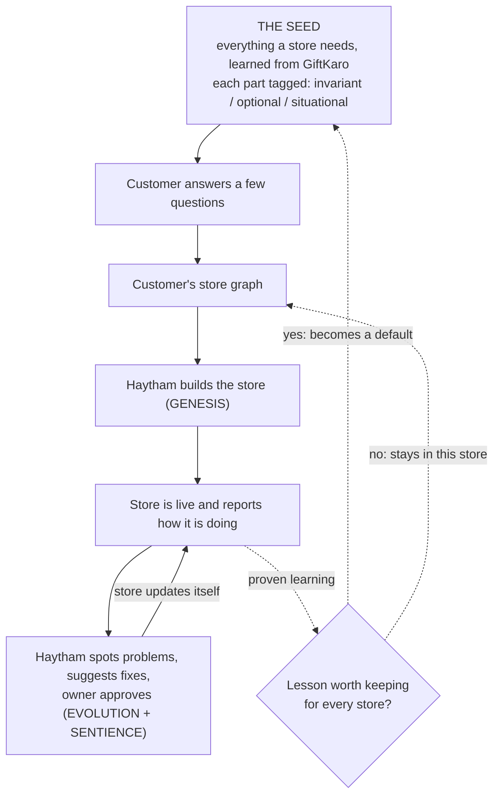

# Commerce Vertical Thesis (Parked)

**Status:** Parked, 2026-05-31. Not abandoned. See the un-park trigger at the bottom.

**One line:** Verticalize Haytham onto commerce by turning GiftKaro's reasoning graph into a reusable seed, so Haytham builds AND continuously improves online stores for paying customers. The "AI Shopify," where the difference is a true AI-native system, not AI bolted onto a template.

## The insight

GiftKaro.pk was built with Haytham. It is not just a working store, it carries a complete reasoning graph: concept anchor, capabilities, architecture decisions, specs, and a live telemetry contract calibrated against real GA4 data. The improvement loop is already running on it (`derive-criteria` produced the contract, `propose-next-steps` caught and corrected a live calibration error).

GiftKaro is the output, not the product. The product is the factory. The temptation to sell the store is the wrong inference. The right inference: the recurring structure inside GiftKaro's graph can seed any commerce store, and the learnings that accumulate across stores are the asset.

The moat is not the engine that turns a spec into a store. Anyone can build that. The moat is the seed plus the accumulated cross-store learnings, the thing that makes store #50 start smarter than store #1.

## Why commerce, and why it is not a detour

Commerce is the first place all three Haytham milestones get embodied at once, on a customer who pays:

- GENESIS builds the store.
- EVOLUTION is the owner's plain-language change requests.
- SENTIENCE is the telemetry-driven proposal loop plus the back-channel into the seed.

Today the roadmap is proven on disconnected test projects we own. Commerce is how we prove the whole thesis end to end with external money behind it. This holds on exactly one condition: the engine stays generic. The day commerce logic leaks into the Haytham engine, we have traded a factory for one product line and the broader bet dies.

Commerce is a good first vertical for a specific reason: the telemetry is dense and clean (conversion, AOV, cart abandonment, funnel drop-off), which is the fuel SENTIENCE needs, and the ROI is legible to a non-technical buyer.

## The full loop

The dotted back-channel is what makes this a factory instead of a pile of stores. One store's hard-won lesson becomes every future store's starting advantage.

### What the seed adapts (proof it is generic, not GiftKaro-shaped)

The seed carries GiftKaro's recorded `rationale`, `status`, and `scope_risk` fields. That metadata lets the system sort load-bearing commerce invariants from one founder's situational choices. Worked example, a coffee roaster on live Stripe:

- WhatsApp-handoff checkout was a workaround for GiftKaro's blocked payment gateway (`DEC-PAYMENTS-001` is marked superseded). A customer with working Stripe never activates it.
- USD-only fixed-rate pricing drops out when multi-currency through Stripe is available.
- Subscriptions are an optional capability GiftKaro never built. The seed flags this as a gap that needs real synthesis, instead of hallucinating a gift-shaped answer.

A template cannot know WhatsApp-handoff is a hack. The graph says so in a structured field. That is why a graph seed beats a template, and it is the moat no template system can copy without rebuilding around a graph.

## The structural call

**Do not fork the engine.** The commerce product is Haytham's same engine plus a commerce seed (a data artifact) plus one net-new capability (the promotion gate). Forking duplicates the engine, forces every improvement to be ported twice, and kills Haytham's ability to ever serve a second vertical. A fork would make Haytham worse at the thing it is uniquely good at.

**Build a separate private repo that consumes Haytham as an engine.**

- Haytham engine: stays where it is, generic, can stay public. Not the moat, nothing to protect.
- New private repo: the commerce seed, the promotion gate, and eventually the SaaS wrapper (tenancy, billing, onboarding). This is the company. Private because the seed and the fleet of learnings are the IP.

**Control plane stays clean.** The seed and all per-customer graphs are control plane (Haytham's domain). The running stores are data plane (delegated runtime: Vercel, Supabase, Stripe). The back-channel moves graph deltas and telemetry contracts, never customer data.

## Maturity read

| Loop | Status today | What productizing needs |
|---|---|---|
| GENESIS (graph to store) | Proven, GiftKaro is live | Parameterize the seed; intake flow |
| EVOLUTION (plain-language change) | Proven, GiftKaro shipped via evolve | Multi-tenant per-customer graphs |
| SENTIENCE (telemetry to proposal) | Running on 1 store, human-in-loop, pre-conversion | Cadence and autonomy controls |
| Back-channel (instance to seed) | Does not exist | Net-new: the promotion gate |

Three of four loops exist, two are proven. The only net-new piece is the back-channel, and it is the one that turns "built one store" into "factory that compounds." Everything else is recombination of parts already shipped.

## Why it is parked

The factory thesis rests on cross-store learnings compounding. We have zero cross-store data. GiftKaro is N=1 and has not converted a customer (238 sessions, no conversions at time of writing). Building SaaS infrastructure now is paying for the expensive, known, boring part (tenancy, billing, hosting) before validating the cheap, unknown, load-bearing part (the seed generalizing and learnings promoting).

Attack the cheap unknown first.

## Un-park trigger

Resume this when, and only when, the validation sequence below has run and passed. Until then, the lab work below is the most this should consume. Do not build SaaS infrastructure before step 4 passes.

1. Stand up the private commerce-lab repo. Engine consumed as a dependency.
2. Extract the seed from GiftKaro's graph, with invariant / optional / situational tags.
3. Run one second store through it manually (a real coffee-roaster-type customer, or TinyTales reframed as commerce, which doubles as the cross-project test). Watch one thing: does the seed generalize without leaking gift-isms? Does it correctly drop the WhatsApp workaround and flag the subscription gap?
4. Promote one real learning from GiftKaro into the seed and confirm store #2 inherits it. That single observation is the entire factory thesis in miniature.

If step 4 works, we have evidence no competitor has, and the SaaS build is justified. If it fails, we found the flaw for the price of one extraction.

## Deferred decision

There is a real fork underneath this: stay "Haytham, the generic factory" with commerce as the first vertical, or go all-in as a commerce company where generic Haytham was just the path here. That is a question about ambition, and it does not need answering yet, because the next action is identical either way. The seed and store #2 are required regardless. The fork will be clearer with cross-store data than as a thought experiment today.

## Related

- [pivot-plan.md](pivot-plan.md)
- [gtm-strategy.md](gtm-strategy.md)
- [system-evolution.md](system-evolution.md)
- A publishable blog post lives in this material too: "used a meta-system to build a product, then mined its reasoning graph to seed a vertical." Write it from evidence after store #2, not from this thesis.
