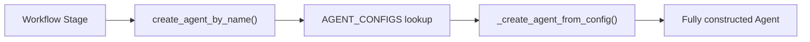

# Agent Development Guide

This guide expands upon the "Adding a New Agent" section in `CLAUDE.md` and should be kept consistent with it. If architectural changes are made, update both documents together.

---

## 1. Overview of Haytham Agent Architecture

Haytham uses a configuration-driven architecture for defining and constructing agents.

All agents are defined in a single registry (`AGENT_CONFIGS`) in `haytham/config.py`. No conditionals, no hardcoded classes.

Each agent is defined using an `AgentConfig` object, which defines:

- `name`
- `prompt_key`
- `max_tokens`
- `timeout_config`
- `tool_profile`
- `model_tier`
- `streaming`
- `use_file_ops_model`
- `structured_output_model`
- `structured_output_model_path`
- `custom_system_prompt`

Agents must be created using:

```python
create_agent_by_name(agent_name)
```

The factory:

- Looks up the agent in `AGENT_CONFIGS`
- Resolves structured output models dynamically (if configured)
- Applies runtime overrides
- Delegates construction to `_create_agent_from_config`
- Attaches required hooks and tracing attributes
- Ensures correct model tier routing

### High-level flow



New agents can be added without modifying factory logic (Open-Closed Principle).

---

### Model Tier Guidance

Select the appropriate `model_tier` based on task complexity:

- **LIGHT** — Extraction, summarization, simple transformations
- **HEAVY** — Structured output generation, synthesis, complex reasoning
- **REASONING** — Cross-referencing, validation workflows, multi-step logic

Choosing the correct tier ensures appropriate capability and cost efficiency.

---

## 2. Factory Usage Requirement

All agents must be instantiated via:

```python
create_agent_by_name(agent_name)
```

Direct instantiation of `Agent()` is prohibited. Bypassing the factory skips `HaythamAgentHooks` (no observability), name assignment (broken OTEL spans), trace attributes (no distributed tracing), and model tier routing (wrong model).

If you have a rare case requiring direct `Agent()` (custom tools, conversation history), you must still add `hooks=[HaythamAgentHooks()]` and `name=` manually. See `haytham/agents/hooks.py`.

---

## 3. Adding a New Agent

Adding a new agent is done entirely through configuration.

### Step 1: Create the Prompt Directory

Create a directory under:

```
haytham/agents/
```

Follow the naming convention:

```
worker_{agent_name}/
```

Inside that directory, create:

```
worker_{agent_name}_prompt.txt
```

Example:

```
haytham/agents/worker_concept_summarizer/
    worker_concept_summarizer_prompt.txt
```

The `prompt_key` in `AgentConfig` must match the worker directory name.

---

### Step 2: Register in `AGENT_CONFIGS`

Open:

```
haytham/config.py
```

Add:

```python
"concept_summarizer": AgentConfig(
    name="concept_summarizer_agent",
    prompt_key="worker_concept_summarizer",
    max_tokens=TOKENS_DEFAULT,
)
```

Optional fields include `tool_profile`, `model_tier`, `structured_output_model_path`, and `custom_system_prompt`. See the full `AgentConfig` field list in Section 1.

---

### Step 3: Register in `STAGE_CONFIGS`

If the agent participates in a workflow stage (most do), add a `StageExecutionConfig` in `haytham/workflow/stages/configs.py`:

```python
"concept_summary": StageExecutionConfig(
    stage_slug="concept-summary",
    query_template="Summarize the following concept: {system_goal}",
)
```

Key `StageExecutionConfig` fields (defined in `haytham/workflow/stage_executor.py`):

| Field | Purpose |
|---|---|
| `stage_slug` | Stage identifier, must match `StageMetadata` in the registry |
| `query_template` | Prompt template, supports `{system_goal}` placeholder |
| `parallel_agents` | List of `{"name": ..., "query": ...}` dicts for parallel execution |
| `post_processor` | Callable to extract structured data from output (e.g., risk level) |
| `post_validators` | ADR-022 cross-stage consistency checks |
| `output_model` | Pydantic model for JSON/markdown split rendering |
| `programmatic_executor` | For stages that don't need an LLM agent |

You also need a `StageMetadata` entry in `stage_registry.py` and a Burr action in `burr_actions.py`. See the "Adding a New Stage" section in CLAUDE.md for the full checklist.

---

## 4. Structured Output (Optional)

If the agent must return structured JSON, define a Pydantic model:

```python
from pydantic import BaseModel

class ConceptSummary(BaseModel):
    title: str
    summary: str
    key_points: list[str]
```

Then configure:

```python
"concept_summarizer": AgentConfig(
    name="concept_summarizer_agent",
    prompt_key="worker_concept_summarizer",
    max_tokens=TOKENS_DEFAULT,
    structured_output_model_path="haytham.schemas.concept_summary.ConceptSummary",
)
```

When `structured_output_model_path` is provided, the factory dynamically resolves and enables structured output parsing.

---

## 5. Testing Agents

Agents must be tested without making real LLM calls.

### Unit Testing (Mocked LLM)

Tests must mock the LLM client so no real calls are made. Verify that the agent loads correctly, uses the right prompt, and produces expected output (including structured output if configured).

See `tests/test_stage_executor.py` for the standard mocking pattern used across the project, and `tests/test_context_summarizer.py` for an agent-specific example.

---

### LLM-as-Judge Evaluation (ADR-018)

Agent quality is validated using the LLM-as-Judge framework (ADR-018).

Run:

```
make test-agents
```

Quick mode:

```
make test-agents-quick
```

To record fixtures:

```
make record-fixtures
```

All new agents should integrate with this evaluation framework where applicable.

---

### Output Extraction

Agent responses must be processed using:

```python
extract_text_from_result()
```

(from `haytham/agents/output_utils.py`)

This ensures standardized text extraction across all agents.

---

## 6. Tool Calling

Agents may define tools via `tool_profile` in `AgentConfig`.

Tool implementation rules:

- Tools must never raise exceptions. Return structured error responses instead.
- Tool parameters must be strongly typed.
- Provide comprehensive docstrings (the LLM reads both types and docstrings).
- Tool outputs should be deterministic and structured.
- Tool configuration must be defined in `AGENT_CONFIGS`, not in the factory.

---

## 7. Workflow Integration

Agents execute within the Burr orchestration workflow:

- A workflow stage is triggered.
- `STAGE_CONFIGS` determines which agent runs.
- The workflow calls `create_agent_by_name()`.
- The factory builds the agent from `AGENT_CONFIGS`.
- The agent executes with configured prompt, tools, and model tier.
- Output is processed and passed to the next stage.

This separation keeps agents modular and workflow logic independent.

---

## 8. Architectural References

This guide follows architectural patterns defined in:

```
docs/contributing/architecture-patterns.md
```

That document describes:

- Core system design principles
- Agent registration patterns
- Workflow orchestration structure
- Extensibility guidelines

New contributors should review it alongside this guide.
