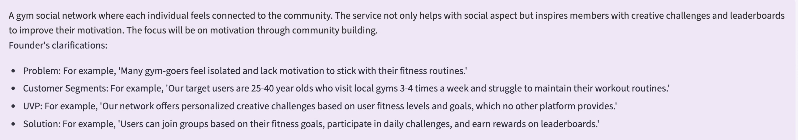
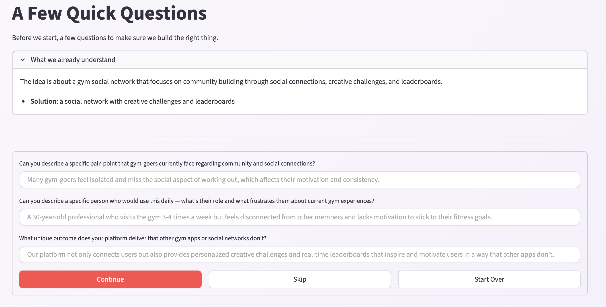
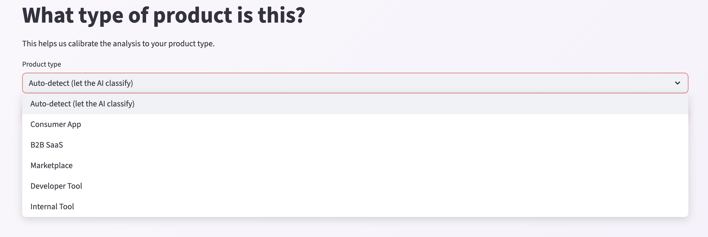
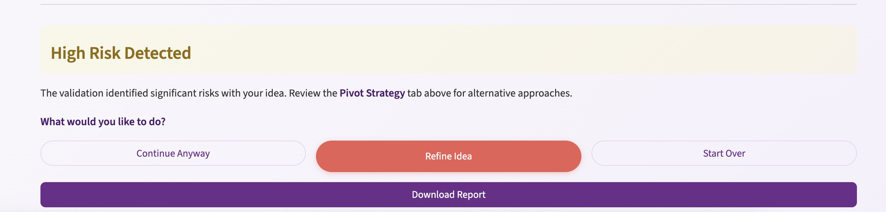
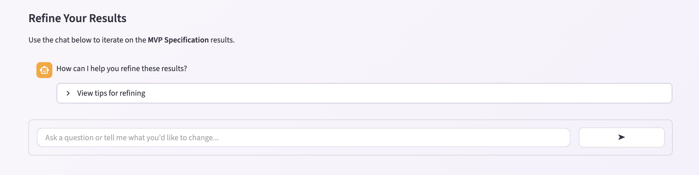
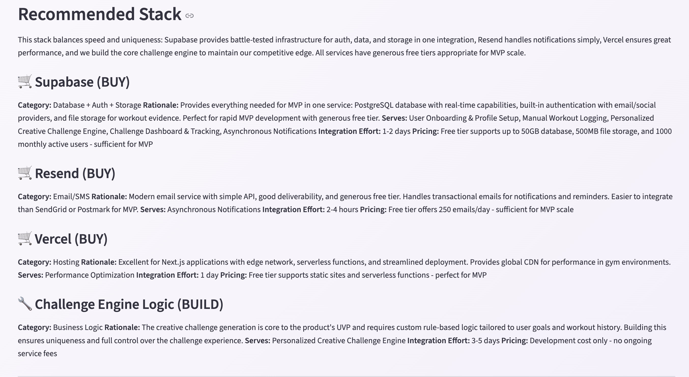
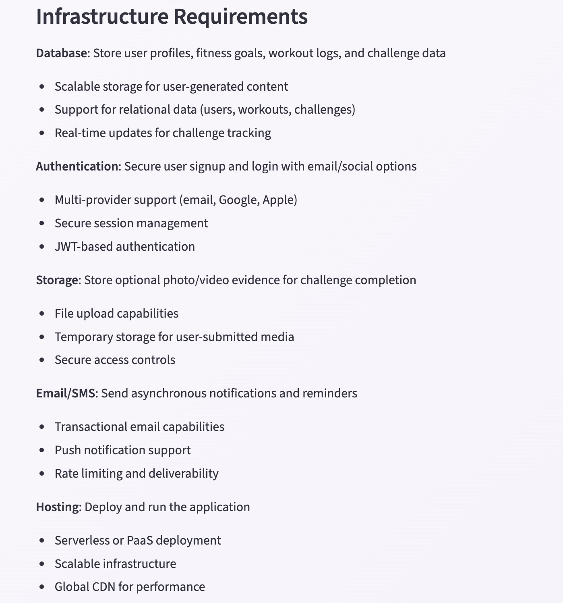
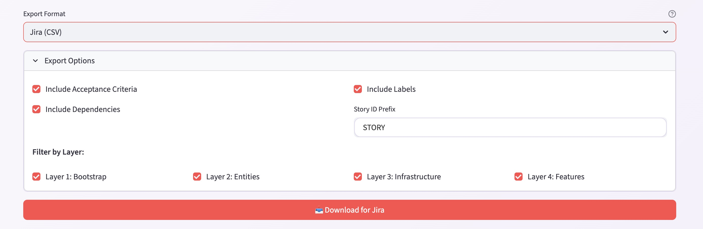

# Example Session: Gym Social Network

A complete walkthrough of Haytham processing a real startup idea from input to implementation-ready stories.

**Idea:** A gym social network focused on community building through creative challenges, leaderboards, and motivation.

---

## Discovery: Idea Refinement

### 1. User submits their idea

The founder describes a gym social network with community challenges and leaderboards, along with clarifications about the problem, target users, unique value proposition, and solution.

### 2. Haytham asks clarifying questions

The Idea Discovery agent identifies coverage gaps and asks targeted questions about specific pain points, target users, and unique outcomes. The founder fills in details before proceeding.

### 3. Product type classification

The system classifies the product type (Consumer App, B2B SaaS, Marketplace, Developer Tool, Internal Tool) to calibrate the analysis. Auto-detect lets the AI classify based on the idea.

---

## Phase 1: Should This Be Built?

### 4. Validation verdict: High Risk Detected

After market intelligence, competitor analysis, and risk assessment, the validation scorer flags significant risks. The founder can Continue Anyway, Refine Idea, or Start Over. A downloadable validation report is available.

---

## Phase 2: What Exactly?

### 5. Refine results

After MVP scoping, the founder can iterate on the specification using a chat interface. Ask questions, request changes, or refine scope boundaries before approving.

---

## Phase 3: How to Build It?

### 6. Recommended stack (Build/Buy decisions)

The Build/Buy Analyzer evaluates each capability and recommends: Supabase (BUY) for database, auth, and storage; Resend (BUY) for email/SMS; Vercel (BUY) for hosting; and Challenge Engine Logic (BUILD) as the core differentiator.

### 7. Infrastructure requirements

Abstract infrastructure requirements derived from the capability model: database, authentication, storage, email/SMS, and hosting, each with specific needs.

---

## Phase 4: What Are the Tasks?

### 8. Export to Jira

Generated stories can be exported as Jira CSV with configurable options: acceptance criteria, labels, dependencies, and layer filtering (Bootstrap, Entities, Infrastructure, Features).

### 9. Generated stories

25 implementation-ready stories exported in [project-stories.csv](project-stories.csv), covering:

- Project initialization and configuration (STORY-001)
- Authentication and database setup (STORY-002, STORY-003)
- Core features: onboarding, workout logging, challenge engine, dashboard (STORY-004 through STORY-008)
- Notifications, performance, security, accessibility (STORY-008 through STORY-011)
- Deployment, real-time updates, data integrity (STORY-012 through STORY-025)

Each story includes a description, acceptance criteria, layer assignment, and dependency ordering.
