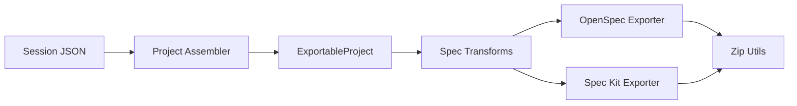

# Exports

Haytham exports your validated spec in two formats designed for AI coding agents: **OpenSpec** and **Spec Kit**. Both are available as zip downloads after the STORIES phase completes.

## Format Comparison

| | OpenSpec | Spec Kit |
|---|---|---|
| **Origin** | [Fission AI](https://github.com/Fission-AI/OpenSpec) | [GitHub](https://github.com/github/spec-kit) |
| **Style** | Lightweight, capability-oriented | Richer artifacts with data models, API contracts, constitution |
| **Change management** | Spec deltas via `changes/` directory | GitHub-native (PRs against `.specify/`) |
| **Best for** | Iterating on an existing spec | Greenfield projects |
| **Output directory** | `openspec/` | `.specify/` |

## What Gets Exported

Every Haytham artifact maps to a specific location in each format.

| Haytham Artifact | OpenSpec | Spec Kit |
|---|---|---|
| Capabilities (CAP-F-\*, CAP-NF-\*) | `specs/{domain}/spec.md` as SHALL statements | `specs/{feature}/spec.md` as functional requirements |
| Acceptance criteria | Gherkin scenarios in `spec.md` | User scenarios in `spec.md`, success criteria |
| Architecture decisions (DEC-\*) | `project.md` | `specs/{feature}/plan.md` |
| Build/buy recommendations | `project.md` | `specs/{feature}/plan.md` |
| System traits | `config.yaml` | `memory/constitution.md` as system principles |
| Non-functional capabilities | `specs/cross-cutting/spec.md` | `memory/constitution.md` as quality attributes |
| Stories (dependency-ordered) | Referenced in spec scenarios | `specs/{feature}/tasks.md` (phased) |
| Data models (Layer 2 stories) | -- | `specs/{feature}/data-model.md` |
| API contracts (Layer 3 stories) | -- | `specs/{feature}/contracts/api.md` |

## Directory Structures

### OpenSpec

```
openspec/
├── config.yaml                  # Project metadata, system traits, appetite
├── project.md                   # Tech stack, architecture decisions, build/buy
└── specs/
    ├── user-authentication/
    │   └── spec.md              # SHALL statements + Gherkin scenarios
    ├── leaderboard-management/
    │   └── spec.md
    └── cross-cutting/
        └── spec.md              # Non-functional requirements
```

### Spec Kit

```
.specify/
├── memory/
│   └── constitution.md          # System principles, quality attributes, versioning
└── specs/
    ├── 001-user-authentication/
    │   ├── spec.md              # User scenarios, functional requirements, success criteria
    │   ├── plan.md              # Architecture decisions, build/buy for this feature
    │   ├── tasks.md             # Phased story checklist (setup, foundational, user stories)
    │   ├── data-model.md        # From Layer 2 stories (if any)
    │   └── contracts/
    │       └── api.md           # From Layer 3 stories (if any)
    ├── 002-leaderboard-management/
    │   ├── spec.md
    │   ├── plan.md
    │   └── tasks.md
    └── ...
```

## Using Exports with Coding Agents

Download the zip, extract it into your project root, and point your coding agent at the spec files.

### Claude Code

Add the spec directory to your `CLAUDE.md`:

```markdown
# Project Spec
See `openspec/` (or `.specify/`) for the full specification.
Start with `openspec/project.md` for architecture context,
then implement specs in `openspec/specs/` order.
```

### Cursor / Copilot

Add the spec directory to your workspace rules or `.cursorrules`:

```
Reference the specification files in openspec/ (or .specify/) when
implementing features. Each spec.md contains requirements and
acceptance criteria as test scenarios.
```

### Generic Agents

Any agent that reads markdown files from disk can consume either format. Point the agent at the top-level directory (`openspec/` or `.specify/`) and let it discover the structure.

## How It Works

The export pipeline is deterministic (no LLM calls). It reads structured JSON from the session directory and transforms it into spec files.



1. **Project Assembler** (`project_assembler.py`) reads the execution contract, capability model, architecture decisions, and build/buy analysis from session JSON files. Produces an `ExportableProject`.
2. **Spec Transforms** (`spec_transforms.py`) provides shared utilities: capability-to-SHALL conversion, Gherkin rendering, slugification, traits-to-constitution mapping.
3. **Format exporters** (`openspec_exporter.py`, `speckit_exporter.py`) consume `ExportableProject` and produce a `dict[str, str]` mapping file paths to content.
4. **Zip Utils** (`zip_utils.py`) packs the file tree into a downloadable zip archive.

The structured data layer that makes this possible is the Execution Contract, defined in [ADR-028](adr/ADR-028-execution-contract-schema.md).

## Links

- [OpenSpec repository](https://github.com/Fission-AI/OpenSpec)
- [Spec Kit repository](https://github.com/github/spec-kit)
- [ADR-028: Execution Contract Schema](adr/ADR-028-execution-contract-schema.md)
- [Spec Export Design Document](plans/2026-02-27-spec-export-design.md)
