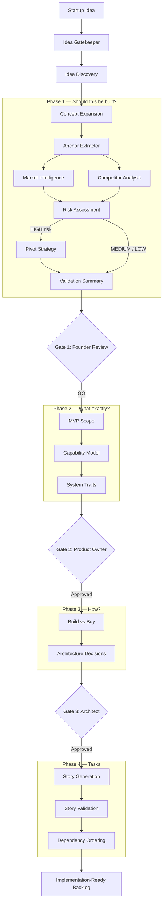
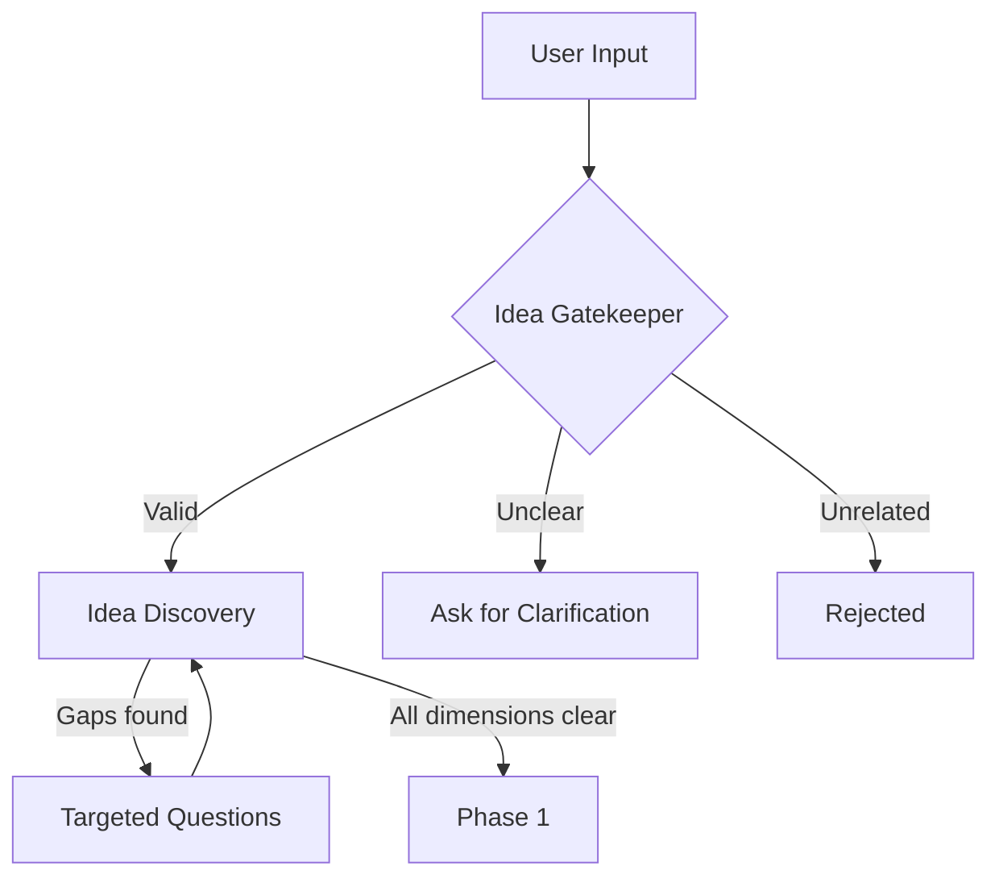

# How It Works

Haytham processes a startup idea through four sequential phases, each answering a specific question. A human approval gate separates each phase — nothing proceeds without your sign-off.

### Design Principles

- **Structure over speed.** Good systems require good decisions. Haytham enforces the questions experienced architects ask — problem framing, scope boundaries, build-vs-buy trade-offs, capability traceability — before any code is written.
- **Honesty over flattery.** If the idea doesn't hold up, the system says NO-GO and tells you why. Only validated ideas proceed to specification.
- **Human over automation.** Every decision is surfaced for review. Each stage output is a conversation — disagree with the architecture, challenge the scope, refine the verdict.
- **Traceability over magic.** Every story traces to a capability, every capability to a validated need, every decision to the capabilities it serves. When stories reach a developer or coding agent, they carry full context.

---

## Pipeline Overview

---

## Discovery: Idea Refinement

Before running any analysis, Haytham checks whether the idea has enough substance to evaluate.

The **Idea Gatekeeper** classifies input as valid, needing clarification, or unrelated. The **Idea Discovery** agent then assesses coverage across four dimensions — problem, customer, unique value proposition, and solution — using [Lean Canvas](https://leanstack.com/lean-canvas), [The Mom Test](https://www.momtestbook.com/), and [Jobs-to-be-Done](https://jtbd.info/) frameworks. If gaps exist, the system asks targeted questions for only what's missing.

---

## Phase 1: Should This Be Built?

Determine if the idea is viable before investing in specification.

**Concept Expansion** transforms the raw idea into a structured startup concept with problems, trigger moments, target segments, and an initial [Lean Canvas](https://leanstack.com/lean-canvas).

#### Solving the telephone problem

In a multi-agent pipeline, each agent subtly shifts meaning toward the generic case. After several hops, the output can describe a fundamentally different product — a real-world test showed a psychologist's closed-community wish-exchange app becoming a generic open-registration encouragement board by the time stories were generated.

The **Anchor Extractor** prevents this. Before any analysis begins, it captures a small, immutable artifact from the original input: the user's core intent, a set of invariants (properties that must remain true in every downstream output), and identity markers (what makes this idea distinctive rather than generic). This anchor bypasses the agent chain entirely — every downstream agent receives it unchanged as a constraint, not as context that can be reinterpreted.

Independent phase-boundary verifiers then check each phase's output against the anchor at decision gates. If an invariant is violated — say, MVP Scope quietly drops the closed-community requirement — the verifier surfaces it for review before the next phase runs. This is external verification, not self-checking: a separate agent with a narrow mandate reviews the producing agent's work. See [ADR-022](adr/ADR-022-concept-fidelity-pipeline-integrity.md) for the full design.

**Market Intelligence** and **Competitor Analysis** run in parallel. Market Intelligence uses the [Jobs-to-be-Done](https://jtbd.info/) framework to identify core functional, emotional, and social jobs, then sizes the opportunity using [TAM/SAM/SOM](https://en.wikipedia.org/wiki/Total_addressable_market) analysis. Competitor Analysis anchors searches around the customer job rather than the product category — finding competitors across markets that solve the same job — and evaluates switching costs, lock-in factors, and market structure. Both agents include explicit confirmation bias checks to ensure findings aren't shaped to fit a predetermined conclusion.

The **Startup Validator** extracts 10–15 key claims and validates each against evidence, classifying risk as HIGH / MEDIUM / LOW. The **Validation Summary** then applies a [Stage-Gate](https://en.wikipedia.org/wiki/Stage-gate_model) scorecard (Robert Cooper) with three knockout criteria and six scored dimensions to produce a GO / NO-GO / PIVOT verdict. The scorer uses tool calls to build a scorecard incrementally — each tool validates evidence quality, rejects rubric phrases, and prevents the same evidence from being cited for multiple dimensions. If risk is HIGH, a **Pivot Strategy** agent proposes alternatives before the verdict is finalized.

### Gate 1: Founder Review

- **GO** — Proceed to MVP specification
- **PIVOT** — Re-run with adjusted scope
- **NO-GO** — Stop. The idea isn't viable.

---

## Phase 2: What Exactly Should We Build?

Define a focused, achievable first version. **MVP Scope** uses [Shape Up](https://basecamp.com/shapeup) appetite-based scoping (Small / Medium / Large time constraints) to right-size the first version. It identifies the core value proposition, defines a single primary user segment, in/out-of-scope boundaries, success criteria, and 2–3 core user flows.

**Capability Model** decomposes the scope into 3–5 functional and 2–4 non-functional capabilities using standard [capability mapping](https://en.wikipedia.org/wiki/Business_capability_model), each traced to the user flows that justify it. **System Traits** classifies the system type — interface, auth model, deployment targets, data layer — to inform downstream architecture. Without this classification, story generation defaults to web-app patterns (dashboard pages, browser navigation) regardless of whether the product is a CLI tool, an API service, or a mobile app. Traits detection ensures downstream agents generate stories appropriate to the actual system type. See [ADR-019](adr/ADR-019-system-trait-detection.md).

### Gate 2: Product Owner Review

- **Approved** — Scope is locked, proceed to technical design
- **Revise** — Adjust scope boundaries or capabilities

---

## Phase 3: How Should We Build It?

Make key architecture and technology decisions before writing stories. **Build/Buy Analyzer** evaluates each capability using a six-dimension weighted scoring model — complexity, time-to-build, maintenance burden, cost-at-scale, vendor lock-in risk, and differentiation value — to recommend BUILD, BUY, or HYBRID per capability. **Architecture Decisions** records key technical choices — component structure, technology stack, integration patterns, deployment approach — as DEC-* records with rationale and the capabilities each serves.

### Gate 3: Architect Review

- **Approved** — Architecture locked, proceed to story generation
- **Revise** — Adjust technology or integration decisions

---

## Phase 4: What Are the Tasks?

Generate an ordered backlog ready for execution. **Story Generation** creates user stories in standard Agile format ("As a [role], I want to [action] so that [benefit]") with acceptance criteria written in [Gherkin](https://cucumber.io/docs/gherkin/) (Given/When/Then). BUILD capabilities get implementation stories, BUY capabilities get integration stories, each tagged `implements:CAP-*`. The output includes an [entity-relationship model](https://en.wikipedia.org/wiki/Entity%E2%80%93relationship_model) covering domain entities, attributes, and relationships.

**Story Validation** verifies every capability is covered and validates against [INVEST](https://en.wikipedia.org/wiki/INVEST_(mnemonic)) criteria. **Dependency Ordering** resolves dependencies into a directed acyclic graph (DAG) and orders stories across a six-layer architecture: Foundation → Auth → Integrations → Core → UI → Real-time.

### Final Output

Every story links to the capability it implements (`implements:CAP-F-001`), the decisions it depends on (`uses:DEC-001`), and the entities it touches (`touches:ENT-001`). This specification is the execution contract — whether the executor is a human developer, a hosted coding agent, or a cloud-native service agent, they receive the same traced context.

---

## Agents at a Glance

Twenty-one specialist agents, some working individually and others coordinating in multi-agent swarms. Swarm sub-agents are indented below their parent.

| # | Agent | Phase | Responsibility | Frameworks |
|---|-------|-------|----------------|------------|
| 1 | Idea Gatekeeper | Discovery | Classify input quality | — |
| 2 | Idea Discovery | Discovery | Assess coverage gaps, generate targeted questions | Lean Canvas, The Mom Test, JTBD |
| 3 | Anchor Extractor | Phase 1 | Extract core concept anchor before expansion | — |
| 4 | Concept Expansion | Phase 1 | Structure raw idea into validated concept | Lean Canvas |
| 5 | Market Intelligence | Phase 1 | Research market size, trends, core jobs | JTBD (functional/emotional/social), TAM/SAM/SOM |
| 6 | Competitor Analysis | Phase 1 | Find and analyze real competitors | JTBD-anchored search, switching cost analysis |
| 7 | Startup Validator | Phase 1 | Validate claims, classify risk | Claims-based validation, archetype calibration |
| 8 | Pivot Strategy | Phase 1 | Propose alternatives when risk is high | — |
| 9 | Validation Scorer | Phase 1 | Score dimensions, detect knockouts, compute verdict | Stage-Gate scorecard (Robert Cooper) |
| 10 | Validation Narrator | Phase 1 | Generate prose report from scorer results | — |
| 11 | Validation Summary | Phase 1 | Merge scorer + narrator into final verdict | Deterministic merge with verdict fix |
| 12 | MVP Scope (swarm) | Phase 2 | Define focused first version | Shape Up (appetite-based scoping) |
| 13 | ↳ Scope Boundaries | Phase 2 | Define in/out-of-scope boundaries | — |
| 14 | ↳ Scope Core | Phase 2 | Identify core value proposition and user segment | — |
| 15 | ↳ Scope Flows | Phase 2 | Define primary user flows | — |
| 16 | MVP Specification | Phase 2 | Assemble final MVP spec from swarm outputs | — |
| 17 | Capability Model | Phase 2 | Map functional and non-functional requirements | Capability mapping, traceability matrix |
| 18 | System Traits | Phase 2 | Classify system type for downstream decisions | 8-trait system classification |
| 19 | Build/Buy Analyzer | Phase 3 | Decide build vs buy per capability | 6-dimension weighted scoring |
| 20 | Architecture Decisions | Phase 3 | Make key technical decisions | — |
| 21 | Story Generation | Phase 4 | Create user stories with validation and dependency ordering | Agile user stories, Gherkin/BDD, INVEST, DAG ordering |

---

## Key Behaviors

### Stage-Level Iteration

Each stage persists its output independently. This means:

- **Resume from any point.** If the process is interrupted, it picks up from the last completed stage without re-running earlier work.
- **Re-run selectively.** Revising MVP scope (Phase 2) doesn't re-run the web-search-heavy market analysis (Phase 1). Only the changed phase and its downstream dependencies re-execute.
- **Tweak one agent at a time.** Each agent has a single focused job with its own prompt file, model tier, and output schema. Improving one agent's prompt doesn't require touching anything else.
- **Test independently.** Each agent can be tested in isolation with fixed inputs and an LLM judge that evaluates output quality against criteria — catching prompt regressions before they reach users. See [ADR-018](adr/ADR-018-llm-as-judge-agent-testing.md).

This decomposition is a deliberate trade-off: more stages means more inter-stage handoffs to manage, but each stage is small enough to debug, iterate on, and improve quickly and cheaply.

### Refinement at Every Stage

Each stage output is a conversation. You can discuss the output with the system, ask for explanations, request changes, and re-run with different guidance before approving.

### Cost-Aware Design

Running 21 agents with web search on a commercial API has real cost. Three mechanisms keep it manageable:

**Three model tiers.** Not every agent needs the most capable model. Agents doing complex cross-referencing — validation scoring, risk assessment — use a reasoning-tier model. Agents doing substantial generation — market analysis, story writing — use a heavy-tier model. Simple classification and formatting tasks — anchor extraction, idea gatekeeper — use a lightweight model. Each tier maps to a configurable model ID, so you control the cost/quality trade-off per deployment.

**Structured output.** Fifty-three Pydantic models constrain LLM responses to required fields — no wasted tokens on prose the system doesn't need. The agent returns a typed JSON object, not a free-form essay that then needs parsing. The trade-off: structured output works well for clean data structures, but for complex multi-step processes like validation scoring (which builds a scorecard incrementally through tool calls), rigid schemas are too constraining. The scorer uses tool functions instead, with each tool enforcing evidence quality as it records results.

**Web search fallback chain.** Agents that need real-time data (market intelligence, competitor analysis) search the web through a provider chain: DuckDuckGo (free, no API key) is tried first, falling back to Brave Search or Tavily if it fails. A hard session-wide limit (default: 20 searches across the entire pipeline) prevents runaway loops, and agents are told in their prompts that searches are limited so they plan queries carefully. See [ADR-014](adr/ADR-014-web-search-fallback-chain.md).

### A Control Plane for Execution Agents

Haytham's value extends beyond its own internal agents. The specification it produces — traced capabilities, architecture decisions, ordered stories — is a universal execution contract. Any agent that accepts structured work items can execute against it.

**Planned:** The [Google Stitch](https://stitch.withgoogle.com/) integration (see [ADR-021](../docs/adr/ADR-021-design-ux-workflow-stage.md)) will demonstrate this. A `ux_designer` agent will connect to Stitch's MCP endpoint to generate UI screens, participating in the same workflow engine, approval gates, and traceability chains as every internal agent.

**The broader pattern:** Hosted coding agents (Devin, Amazon Q Developer Agent, Google Jules, Claude Code) can receive traced stories with full specification context. Cloud-native service agents (AWS Bedrock Agents, Google Vertex AI Agents) can receive infrastructure requirements derived from architecture decisions. As more providers expose agent interfaces, the same integration path applies — without architectural changes. What varies is the executor; what stays constant is the specification-driven context and traceability.

See the [Vision](../VISION.md#the-control-plane-orchestrating-execution-agents) for how this shapes each milestone.
