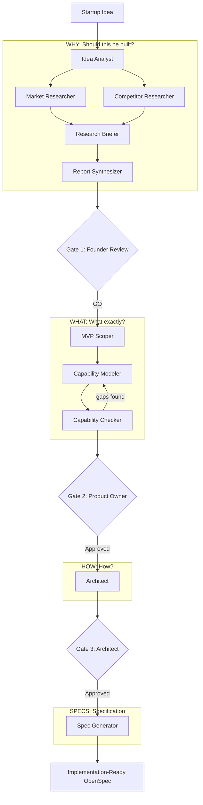

# How It Works

Haytham processes a startup idea through four sequential phases, each answering a specific question. A human approval gate separates each phase, and nothing proceeds without your sign-off.

### Design Principles

- **Structure over speed.** Good systems require good decisions. Haytham enforces the questions experienced architects ask (problem framing, scope boundaries, build-vs-buy trade-offs, capability traceability) before any code is written.
- **Honesty over flattery.** If the idea doesn't hold up, the system says NO-GO and tells you why. Only validated ideas proceed to specification.
- **Human over automation.** Every decision is surfaced for review. Each phase output is a conversation. Disagree with the architecture, challenge the scope, refine the verdict.
- **Traceability over magic.** Every requirement traces to a capability, every capability to a validated need, every decision to the capabilities it serves. When specs reach a developer or coding agent, they carry full context.

---

## Pipeline Overview


```mermaid
flowchart TD
    idea[Startup Idea] --> idea_analyst[Idea Analyst]

    subgraph why["WHY: Should this be built?"]
        idea_analyst --> market[Market Researcher]
        idea_analyst --> competitor[Competitor Researcher]
        market --> briefer[Research Briefer]
        competitor --> briefer
        briefer --> synthesis[Report Synthesizer]
    end

    synthesis --> gate1{Gate 1: Founder Review}
    gate1 -->|GO| mvp

    subgraph what["WHAT: What exactly?"]
        mvp[MVP Scoper] --> capability[Capability Modeler]
        capability --> checker[Capability Checker]
        checker -->|gaps found| capability
    end

    checker --> gate2{Gate 2: Product Owner}
    gate2 -->|Approved| build_buy

    subgraph how["HOW: How?"]
        build_buy[Architect]
    end

    build_buy --> gate3{Gate 3: Architect}
    gate3 -->|Approved| specs

    subgraph specs_phase["SPECS: Specification"]
        specs[Spec Generator]
    end

    specs --> output[Implementation-Ready OpenSpec]
```

---

## Discovery: Idea Refinement

Before running any analysis, the **Idea Analyst** checks whether the idea has enough substance to evaluate. It classifies the input, assesses coverage across four dimensions (problem, customer, unique value proposition, and solution) using Lean Canvas, The Mom Test, and Jobs-to-be-Done frameworks, and extracts concept anchors.

If gaps exist, it asks targeted questions for only what's missing. If the input is unrelated to a startup idea, it rejects it.

### Solving the telephone problem

In a multi-phase pipeline, each agent subtly shifts meaning toward the generic case. After several hops, the output can describe a fundamentally different product.

The Idea Analyst extracts "concept anchors" before any analysis begins: the user's core intent, invariant properties, and identity markers. Every downstream agent receives these anchors unchanged as constraints. If the user says "gym leaderboard with anonymous handles," every phase must reference gyms, leaderboards, and anonymity, not "a community engagement platform with privacy features." See [Lesson 2 in System Evolution](system-evolution.md#2-concept-fidelity-adr-022).

---

## Phase 1: Should This Be Built?

Determine if the idea is viable before investing in specification.

Two research agents run in parallel, both with web search access. The **Market Researcher** uses the Jobs-to-be-Done framework to identify core functional, emotional, and social jobs, then sizes the opportunity using TAM/SAM/SOM analysis. The **Competitor Researcher** anchors its search around the customer job rather than the product category, finding competitors across markets that solve the same job, and profiles their positioning, user sentiment, and gaps.

The **Research Briefer** presents the findings in a non-opinionated format for user review before any verdict is rendered.

The **Report Synthesizer** applies a Stage-Gate scorecard with three knockout criteria and six scored dimensions to produce a GO / NO-GO / PIVOT verdict. This is a single agent with full upstream context, per [Lesson 3 in System Evolution](system-evolution.md#3-single-agent-for-synthesis-adr-026). Two lightweight post-validators (SOM arithmetic and regulated-domain safety) run as hook scripts.

### Gate 1: Founder Review

- **GO**: Proceed to MVP specification
- **PIVOT**: Re-run with adjusted scope
- **NO-GO**: Stop. The idea isn't viable.

---

## Phase 2: What Exactly Should We Build?

Define a focused, achievable first version. The **MVP Scoper** uses Shape Up appetite-based scoping to right-size the first version. It identifies the core value proposition, defines a single primary user segment, in/out-of-scope boundaries, success criteria, and core user flows.

The **Capability Modeler** decomposes the scope into functional and non-functional capabilities using standard capability mapping, each traced to the user flows that justify it. It also classifies system traits (interface type, auth model, deployment targets, data layer) to inform downstream architecture. Without this classification, spec generation defaults to web-app patterns regardless of whether the product is a CLI tool, an API service, or a mobile app.

The **Capability Checker** then audits the model adversarially. A generation pass reliably under-produces capabilities, so a second agent with a destructive mandate hunts for gaps the approved scope already implies: undefined load-bearing terms ("confirmed", "valid"), missing failure surfacing in unattended systems, success metrics no capability produces, flow steps no capability covers. It can only propose additions that quote an existing in-scope item, which keeps it from becoming a scope-creep vector. The founder accepts or rejects each proposal, accepted ones go back through the modeler, and the checker re-runs until a pass finds nothing new (capped at 3 rounds).

### Gate 2: Product Owner Review

The modeler writes `gate-summary.md` alongside the JSON, and the gate renders that file verbatim. It carries what the JSON cannot hold: the behaviors that were cut, the calls that could have gone the other way, and the questions the approved scope left open. The decision record then stores the summary path and a SHA-256 of the text, so the approval names exactly what was read. The validator re-hashes the file on every write and warns if the two ever disagree, which is what makes a post-approval edit detectable rather than merely recorded.

- **Approved**: Scope is locked, proceed to technical design
- **Revise**: Adjust scope boundaries or capabilities

---

## Phase 3: How Should We Build It?

The **Architect** evaluates each capability for build-vs-buy using a weighted scoring model (complexity, time-to-build, maintenance burden, cost-at-scale, vendor lock-in risk, and differentiation value). It recommends BUILD, BUY, or HYBRID per capability. It then records key technical decisions (component structure, technology stack, integration patterns, deployment approach) as DEC-* records with rationale and the capabilities each serves.

### Gate 3: Architect Review

The architect writes `gate-summary.md` the same way: the stack in plain language, the three to five decisions with the highest cost of being wrong, what it costs to run, and the unknowns that still block implementation. The gate renders that file and records its digest in the decision.

- **Approved**: Architecture locked, proceed to specification generation
- **Revise**: Adjust technology or integration decisions

---

## Phase 4: What Are the Specifications?

The **Spec Generator** produces an OpenSpec directory tree: `config.yaml` for project metadata and system traits, `project.md` for architecture decisions and build/buy analysis, and domain-grouped `spec.md` files with SHALL requirements and Gherkin scenarios. Functional capabilities become SHALL statements grouped by domain, non-functional capabilities go into `specs/cross-cutting/spec.md`. Every requirement traces to a capability, and every architecture decision is documented with rationale.

### Final Output

The OpenSpec in `.haytham/session/phase-4-specs/openspec/` is a complete, self-contained specification. Whether the executor is a human developer or a coding agent, they receive the same traced context.

---

## Agents at a Glance

| Agent | Phase | Responsibility | Model |
|-------|-------|----------------|-------|
| Idea Analyst | Discovery/WHY | Classify input, assess coverage, expand concept, extract anchors | sonnet |
| Market Researcher | WHY | Market intelligence (JTBD, sizing, trends, risks) with web search | sonnet |
| Competitor Researcher | WHY | Competitor profiles, sentiment, and positioning with web search | sonnet |
| Research Briefer | WHY | Present research findings neutrally for user review | haiku |
| Report Synthesizer | WHY | Score dimensions, produce GO/NO-GO/PIVOT verdict | opus |
| MVP Scoper | WHAT | Scope definition, boundaries, core flows | sonnet |
| Capability Modeler | WHAT | Capability extraction and system trait classification | sonnet |
| Capability Checker | WHAT | Adversarial gap review of the capability model | sonnet |
| Architect | HOW | Build/buy analysis and architecture decisions | sonnet |
| Spec Generator | SPECS | OpenSpec generation with SHALL statements and Gherkin scenarios | opus |

---

## State Management

Each phase writes structured output to `.haytham/session/`. Phases read upstream context from these files, not from conversation history. This means context compaction doesn't lose critical references (CAP-*, DEC-*, requirement IDs).

```
.haytham/session/
  phase-1-why/
    idea-analysis.md              # Structured idea analysis
    concept-anchor.json           # Invariants that prevent idea drift
    market-research.md            # Market intelligence findings
    competitor-research.md        # Competitor profiles and positioning
    research-brief.md             # Neutral brief for founder review
    validation-report.md          # Synthesis report
    validation-report.json        # Structured recommendation
    gate-decision.json            # Phase, recommendation, user decision
  phase-2-what/
    mvp-scope.md                  # Scope, boundaries, core flows
    capabilities.json             # CAP-F-*, CAP-NF-*
    system-traits.json            # System trait classification
    capability-review.json        # Adversarial gap findings
    gate-summary.md               # Founder-readable summary rendered at Gate 2
    gate-decision.json            # Decision, plus the summary path and digest
  phase-3-how/
    build-buy.json                # BUILD/BUY/HYBRID per capability
    architecture-decisions.json   # DEC-* decisions
    research-directives.json      # What to investigate before coding
    gate-summary.md               # Founder-readable summary rendered at Gate 3
    gate-decision.json            # Decision, plus the summary path and digest
  phase-4-specs/
    openspec/
      config.yaml                 # Project metadata, system traits
      project.md                  # Architecture decisions, build/buy
      specs/*/spec.md             # Domain requirements with scenarios
```
