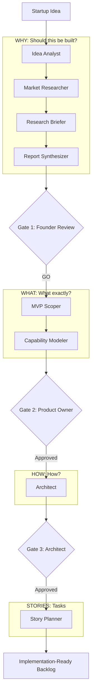

# How It Works

Haytham processes a startup idea through four sequential phases, each answering a specific question. A human approval gate separates each phase, and nothing proceeds without your sign-off.

### Design Principles

- **Structure over speed.** Good systems require good decisions. Haytham enforces the questions experienced architects ask (problem framing, scope boundaries, build-vs-buy trade-offs, capability traceability) before any code is written.
- **Honesty over flattery.** If the idea doesn't hold up, the system says NO-GO and tells you why. Only validated ideas proceed to specification.
- **Human over automation.** Every decision is surfaced for review. Each phase output is a conversation. Disagree with the architecture, challenge the scope, refine the verdict.
- **Traceability over magic.** Every story traces to a capability, every capability to a validated need, every decision to the capabilities it serves. When stories reach a developer or coding agent, they carry full context.

---

## Pipeline Overview


```mermaid
flowchart TD
    idea[Startup Idea] --> idea_analyst[Idea Analyst]

    subgraph why["WHY: Should this be built?"]
        idea_analyst --> market[Market Researcher]
        market --> briefer[Research Briefer]
        briefer --> synthesis[Report Synthesizer]
    end

    synthesis --> gate1{Gate 1: Founder Review}
    gate1 -->|GO| mvp

    subgraph what["WHAT: What exactly?"]
        mvp[MVP Scoper] --> capability[Capability Modeler]
    end

    capability --> gate2{Gate 2: Product Owner}
    gate2 -->|Approved| build_buy

    subgraph how["HOW: How?"]
        build_buy[Architect]
    end

    build_buy --> gate3{Gate 3: Architect}
    gate3 -->|Approved| stories

    subgraph stories_phase["STORIES: Tasks"]
        stories[Story Planner]
    end

    stories --> output[Implementation-Ready Backlog]
```

---

## Discovery: Idea Refinement

Before running any analysis, the **Idea Analyst** checks whether the idea has enough substance to evaluate. It classifies the input, assesses coverage across four dimensions (problem, customer, unique value proposition, and solution) using Lean Canvas, The Mom Test, and Jobs-to-be-Done frameworks, and extracts concept anchors.

If gaps exist, it asks targeted questions for only what's missing. If the input is unrelated to a startup idea, it rejects it.

### Solving the telephone problem

In a multi-phase pipeline, each agent subtly shifts meaning toward the generic case. After several hops, the output can describe a fundamentally different product.

The Idea Analyst extracts "concept anchors" before any analysis begins: the user's core intent, invariant properties, and identity markers. Every downstream agent receives these anchors unchanged as constraints. If the user says "gym leaderboard with anonymous handles," every phase must reference gyms, leaderboards, and anonymity, not "a community engagement platform with privacy features." See [Lesson 2 in System Evolution](system-evolution.md#2-concept-fidelity-adr-022).

---

## Phase 1: Should This Be Built?

Determine if the idea is viable before investing in specification.

The **Market Researcher** uses the Jobs-to-be-Done framework to identify core functional, emotional, and social jobs, then sizes the opportunity using TAM/SAM/SOM analysis. It also anchors competitor searches around the customer job rather than the product category, finding competitors across markets that solve the same job. Both market intelligence and competitor analysis happen in a single agent with web search access.

The **Research Briefer** presents the findings in a non-opinionated format for user review before any verdict is rendered.

The **Report Synthesizer** applies a Stage-Gate scorecard with three knockout criteria and six scored dimensions to produce a GO / NO-GO / PIVOT verdict. This is a single agent with full upstream context, per [Lesson 3 in System Evolution](system-evolution.md#3-single-agent-for-synthesis-adr-026). Two lightweight post-validators (SOM arithmetic and regulated-domain safety) run as hook scripts.

### Gate 1: Founder Review

- **GO**: Proceed to MVP specification
- **PIVOT**: Re-run with adjusted scope
- **NO-GO**: Stop. The idea isn't viable.

---

## Phase 2: What Exactly Should We Build?

Define a focused, achievable first version. The **MVP Scoper** uses Shape Up appetite-based scoping to right-size the first version. It identifies the core value proposition, defines a single primary user segment, in/out-of-scope boundaries, success criteria, and core user flows.

The **Capability Modeler** decomposes the scope into functional and non-functional capabilities using standard capability mapping, each traced to the user flows that justify it. It also classifies system traits (interface type, auth model, deployment targets, data layer) to inform downstream architecture. Without this classification, story generation defaults to web-app patterns regardless of whether the product is a CLI tool, an API service, or a mobile app.

### Gate 2: Product Owner Review

- **Approved**: Scope is locked, proceed to technical design
- **Revise**: Adjust scope boundaries or capabilities

---

## Phase 3: How Should We Build It?

The **Architect** evaluates each capability for build-vs-buy using a weighted scoring model (complexity, time-to-build, maintenance burden, cost-at-scale, vendor lock-in risk, and differentiation value). It recommends BUILD, BUY, or HYBRID per capability. It then records key technical decisions (component structure, technology stack, integration patterns, deployment approach) as DEC-* records with rationale and the capabilities each serves.

### Gate 3: Architect Review

- **Approved**: Architecture locked, proceed to story generation
- **Revise**: Adjust technology or integration decisions

---

## Phase 4: What Are the Tasks?

The **Story Planner** generates user stories in standard Agile format with acceptance criteria in Gherkin (Given/When/Then). BUILD capabilities get implementation stories, BUY capabilities get integration stories, each tagged `implements:CAP-*`. It verifies every capability is covered, validates against INVEST criteria, and resolves dependencies into a directed acyclic graph ordered across architecture layers: Foundation, Auth, Integrations, Core, UI, Real-time.

### Final Output

Every story links to the capability it implements (`implements:CAP-F-001`), the decisions it depends on (`uses:DEC-001`), and the entities it touches (`touches:ENT-001`). This specification is the execution contract. Whether the executor is a human developer or a coding agent, they receive the same traced context.

---

## Agents at a Glance

| Agent | Phase | Responsibility | Model |
|-------|-------|----------------|-------|
| Idea Analyst | Discovery/WHY | Classify input, assess coverage, expand concept, extract anchors | sonnet |
| Market Researcher | WHY | Market intelligence and competitor analysis with web search | sonnet |
| Research Briefer | WHY | Present research findings neutrally for user review | haiku |
| Report Synthesizer | WHY | Score dimensions, produce GO/NO-GO/PIVOT verdict | opus |
| MVP Scoper | WHAT | Scope definition, boundaries, core flows | sonnet |
| Capability Modeler | WHAT | Capability extraction and system trait classification | sonnet |
| Architect | HOW | Build/buy analysis and architecture decisions | sonnet |
| Story Planner | STORIES | Story generation, validation, and dependency ordering | opus |

---

## State Management

Each phase writes structured output to `.haytham/session/`. Phases read upstream context from these files, not from conversation history. This means context compaction doesn't lose critical references (CAP-*, DEC-*, story IDs).

```
.haytham/session/
  phase-1-why/
    idea-analysis.md              # Structured idea analysis
    concept-anchor.json           # Invariants that prevent idea drift
    market-research.md            # Market and competitor findings
    research-brief.md             # Neutral brief for founder review
    validation-report.md          # Synthesis report
    validation-report.json        # Structured recommendation
    gate-decision.json            # Phase, recommendation, user decision
  phase-2-what/
    mvp-scope.md                  # Scope, boundaries, core flows
    capabilities.json             # CAP-F-*, CAP-NF-*
    system-traits.json            # System trait classification
    gate-decision.json
  phase-3-how/
    build-buy.json                # BUILD/BUY/HYBRID per capability
    architecture-decisions.json   # DEC-* decisions
    gate-decision.json
  phase-4-stories/
    stories.json                  # Ordered stories
    execution-contract.json       # Execution contract
    gate-decision.json
```
