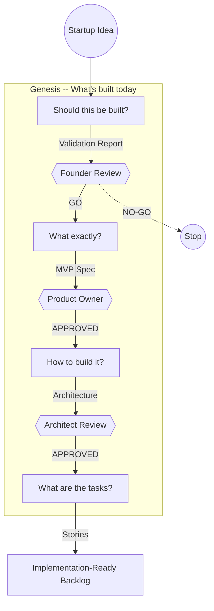

# Haytham

**The control plane for building software systems, from idea to implementation-ready specification.**

Going from "I have a startup idea" to "I have a plan worth building" traditionally requires weeks of planning, domain expertise, and significant capital, with a high risk of building the wrong thing.

Haytham compresses this into an evidence-based process. Specialist agents handle the research, analysis, scoring, and generation. Humans make the decisions at every phase boundary. The output is a complete specification that any developer or coding agent can execute.

If the idea doesn't hold up, the system says NO-GO and tells you why. Only validated ideas proceed to specification.



## What You Get

Feed Haytham a startup idea. What comes out:

- **A verdict**: GO, NO-GO, or PIVOT, backed by evidence. If risks are high, pivot strategies are generated automatically.
- **A scoped MVP**: what's in, what's out, core user flows, and success criteria.
- **A capability model**: functional and non-functional capabilities, each traceable to a user need.
- **Architecture decisions**: build-vs-buy analysis, technology choices, and trade-offs. Each decision linked to the capabilities it serves.
- **Ordered user stories**: with acceptance criteria, dependency ordering, and full traceability. Hand these to a developer or a coding agent.

## Quick Start

You need Python 3.11+ and [uv](https://docs.astral.sh/uv/getting-started/installation/).

```bash
git clone https://github.com/arslan70/haytham.git
cd haytham
uv sync --extra bedrock

cp .env.example .env
# Edit .env: set LLM_PROVIDER=bedrock and configure AWS credentials

make run
# Open http://localhost:8501
```

Haytham also supports **AWS Bedrock**, **OpenAI**, and **Ollama** (free, local). See [Getting Started](getting-started.md) for all provider options.

## How It Works

Four phases, each answering one question: *Should this be built? What exactly? How? What are the tasks?* A human approval gate separates each phase. See [How It Works](how-it-works.md) for the full walkthrough.

## Technology

[Burr](https://github.com/dagworks-inc/burr) (workflow engine), [Strands Agents SDK](https://github.com/strands-agents/sdk-python) (agent framework), [Streamlit](https://streamlit.io/) (UI), [uv](https://docs.astral.sh/uv/) (package manager). See [Technology](technology.md) for the full rationale.

## Project Links

- [GitHub Repository](https://github.com/arslan70/haytham)
- [Vision](https://github.com/arslan70/haytham/blob/main/VISION.md): Genesis, Evolution, Sentience milestones
- [Contributing](https://github.com/arslan70/haytham/blob/main/CONTRIBUTING.md): Development setup and contribution guide
- [Code of Conduct](https://github.com/arslan70/haytham/blob/main/CODE_OF_CONDUCT.md): Community guidelines
- [Security](https://github.com/arslan70/haytham/blob/main/SECURITY.md): Vulnerability reporting

## License

[GNU Affero General Public License v3.0](https://github.com/arslan70/haytham/blob/main/LICENSE)
