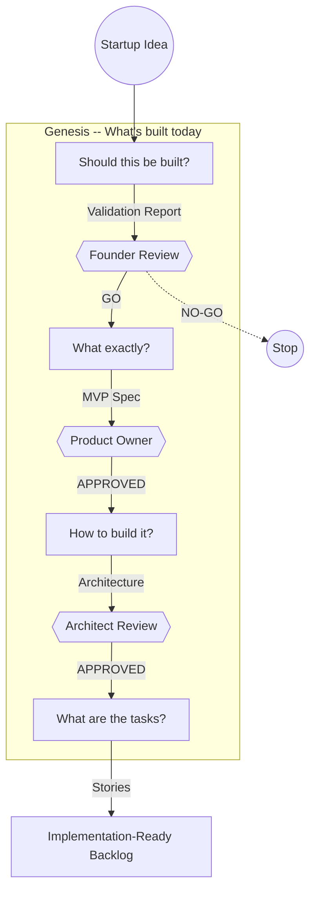

<div class="hero" markdown>

# From startup idea to implementation-ready spec

Haytham validates your idea with real market research, then generates a complete specification any developer or coding agent can execute. If the idea doesn't hold up, it tells you before you waste months building.

<div class="hero-buttons" markdown>

[Get Started](getting-started.md){ .md-button .md-button--primary }
[See It In Action](example-session/index.md){ .md-button }

</div>
</div>

---

## Four phases. Four questions. Human decisions at every gate.

<div class="grid cards" markdown>

-   :material-magnify:{ .lg .middle } **Should this be built?**

    ---

    Market research, competitor analysis, and risk scoring produce a GO / NO-GO / PIVOT verdict backed by evidence.

-   :material-target:{ .lg .middle } **What exactly?**

    ---

    MVP scoping with capability mapping. What's in, what's out, core user flows, and success criteria.

-   :material-wrench:{ .lg .middle } **How to build it?**

    ---

    Build-vs-buy analysis and architecture decisions. Each linked to the capabilities it serves.

-   :material-format-list-checks:{ .lg .middle } **What are the tasks?**

    ---

    Ordered user stories with acceptance criteria, dependency ordering, and full traceability. Ready for a developer or coding agent.

</div>


```mermaid
flowchart TD
    idea(("Startup Idea"))

    idea --> P1

    subgraph genesis["Genesis -- What's built today"]
        P1["Should this be built?"] -->|Validation Report| G1{{"Founder Review"}}
        G1 -->|GO| P2["What exactly?"]
        P2 -->|MVP Spec| G2{{"Product Owner"}}
        G2 -->|APPROVED| P3["How to build it?"]
        P3 -->|Architecture| G3{{"Architect Review"}}
        G3 -->|APPROVED| P4["What are the tasks?"]
    end

    G1 -.->|NO-GO| stop(("Stop"))
    P4 -->|Stories| backlog["Implementation-Ready Backlog"]
```

---

## What you get

<div class="grid cards" markdown>

-   :material-gavel: **A verdict**

    ---

    GO, NO-GO, or PIVOT, backed by market research and risk scoring. If risks are high, pivot strategies are generated automatically.

-   :material-package-variant: **A scoped MVP**

    ---

    What's in, what's out, core user flows, and success criteria. Appetite-based scoping keeps the first version focused.

-   :material-sitemap: **A capability model**

    ---

    Functional and non-functional capabilities, each traceable to a user need. The traceability chain runs from idea to story.

-   :material-cog: **Architecture decisions**

    ---

    Build-vs-buy analysis, technology choices, and trade-offs. Each decision linked to the capabilities it serves.

-   :material-format-list-bulleted-square: **Ordered user stories**

    ---

    Acceptance criteria in Gherkin format, dependency ordering, and full traceability. Hand these to a developer or a coding agent.

-   :material-export:{ .lg .middle } **Agent-ready exports**

    ---

    Download as [OpenSpec](https://github.com/Fission-AI/OpenSpec) or [Spec Kit](https://github.com/github/spec-kit). Feed your spec directly to Claude Code, Cursor, or Copilot.

</div>

---

## Quick start

```bash
git clone https://github.com/arslan70/haytham.git
cd haytham
uv sync
cp .env.example .env   # Configure your LLM provider
make run               # Open http://localhost:8501
```

Supports **AWS Bedrock**, **Anthropic**, **OpenAI**, and **Ollama** (free, local). See [Getting Started](getting-started.md) for all provider options.

---

## Technology

Built with [Burr](https://github.com/dagworks-inc/burr) (workflow engine), [Strands Agents SDK](https://github.com/strands-agents/sdk-python) (agent framework), [Streamlit](https://streamlit.io/) (UI), and [uv](https://docs.astral.sh/uv/) (package manager). See [Technology Stack](technology.md) for the full rationale.

[View on GitHub :fontawesome-brands-github:](https://github.com/arslan70/haytham){ .md-button }
