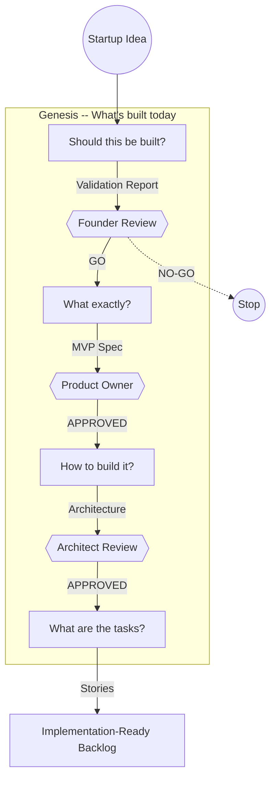

# GitHub Pages Redesign Implementation Plan

> **For Claude:** REQUIRED SUB-SKILL: Use superpowers:executing-plans to implement this plan task-by-task.

**Goal:** Transform the primitive GitHub Pages site into a polished product site targeting founders/users, with a proper blog including dates, tags, and RSS.

**Architecture:** MkDocs Material's built-in blog plugin, grid cards, and custom CSS. No framework change. All styling uses Material's extension points (custom_dir overrides, extra_css, markdown extensions). Blog posts use Material's `blog` plugin with frontmatter metadata.

**Tech Stack:** MkDocs Material 9.x (blog plugin, grid cards, navigation tabs), mkdocs-rss-plugin (RSS feed), custom CSS.

---

### Task 1: Create Custom Stylesheet

**Files:**
- Create: `docs/stylesheets/extra.css`

**Step 1: Create the stylesheets directory and CSS file**

```css
/* docs/stylesheets/extra.css */

/* Hero section */
.md-typeset .hero {
  text-align: center;
  padding: 2rem 0 3rem;
}

.md-typeset .hero h1 {
  font-size: 2.4rem;
  font-weight: 700;
  margin-bottom: 0.5rem;
  color: var(--md-primary-fg-color);
}

.md-typeset .hero .hero-subtitle {
  font-size: 1.15rem;
  color: var(--md-typeset-color);
  opacity: 0.8;
  max-width: 640px;
  margin: 0 auto 1.5rem;
  line-height: 1.6;
}

.md-typeset .hero .hero-buttons {
  display: flex;
  gap: 0.75rem;
  justify-content: center;
  flex-wrap: wrap;
}

.md-typeset .hero .hero-buttons .md-button {
  font-size: 0.9rem;
  padding: 0.6rem 1.5rem;
}

/* Phase cards - tighter spacing */
.md-typeset .grid.cards > ul > li {
  border-left: 3px solid var(--md-primary-fg-color);
}

/* Hide the page title on home since we have a hero */
.md-typeset .home-page > h1:first-child {
  display: none;
}

/* Announcement bar dismiss */
.md-banner {
  font-size: 0.8rem;
}

/* Blog post cards */
.md-typeset .blog .md-post {
  margin-bottom: 1.5rem;
}
```

**Step 2: Commit**

```bash
git add docs/stylesheets/extra.css
git commit -m "docs: add custom stylesheet for GitHub Pages redesign"
```

---

### Task 2: Restructure Blog with Material Blog Plugin

The blog plugin requires a specific directory layout. The existing post must move from `docs/blog/your-agents-are-playing-telephone/` to `docs/blog/posts/`.

**Files:**
- Create: `docs/blog/.authors.yml`
- Create: `docs/blog/index.md`
- Move: `docs/blog/your-agents-are-playing-telephone/index.md` -> `docs/blog/posts/2026-02-20-agents-playing-telephone.md`
- Move: `docs/blog/your-agents-are-playing-telephone/telephone-comic.svg` -> `docs/blog/posts/telephone-comic.svg`
- Delete: `docs/blog/your-agents-are-playing-telephone/` (directory, after move)

**Step 1: Create authors file**

```yaml
# docs/blog/.authors.yml
authors:
  haytham:
    name: Haytham Team
    description: Building multi-agent systems that work
    avatar: https://github.com/arslan70.png
```

**Step 2: Create blog index page**

```markdown
---
title: Blog
description: Lessons from building multi-agent systems
---

# Blog
```

**Step 3: Move the existing blog post and add frontmatter**

Move `docs/blog/your-agents-are-playing-telephone/index.md` to `docs/blog/posts/2026-02-20-agents-playing-telephone.md`.

Move `docs/blog/your-agents-are-playing-telephone/telephone-comic.svg` to `docs/blog/posts/telephone-comic.svg`.

Add this frontmatter to the top of the moved post:

```yaml
---
date: 2026-02-20
authors:
  - haytham
categories:
  - Multi-Agent Systems
  - Architecture
tags:
  - agents
  - pipeline
  - concept-drift
  - error-amplification
description: "Multi-agent pipelines lose your intent one handoff at a time. Here's how to stop playing telephone."
---
```

The image reference `` stays the same since the SVG is in the same directory.

Add an excerpt separator `<!-- more -->` after the first two paragraphs (after "This is the telephone game, except the players are LLMs and the message is your system.") so the blog listing shows a teaser.

**Step 4: Delete old directory**

```bash
rm -rf docs/blog/your-agents-are-playing-telephone/
```

**Step 5: Commit**

```bash
git add docs/blog/
git commit -m "docs: restructure blog for Material blog plugin"
```

---

### Task 3: Rewrite mkdocs.yml

This is the core configuration change. It enables the blog plugin, tabs navigation, custom CSS, announcement bar, and reorganizes the nav.

**Files:**
- Modify: `mkdocs.yml` (complete rewrite)

**Step 1: Rewrite mkdocs.yml**

Key changes from current config:
- Add `plugins:` section with `search`, `blog` (blog_dir: blog, post_url_format: "{slug}"), and `rss`
- Add `extra_css: [stylesheets/extra.css]`
- Add `extra:` with announcement bar and footer social links
- Enable `navigation.tabs`, `navigation.instant`, `navigation.tracking`, `navigation.path`
- Reorganize `nav:` with user-first priority
- Add `attr_list` and `md_in_html` markdown extensions (needed for grid cards and buttons)

```yaml
site_name: Haytham
site_description: From startup idea to implementation-ready specification
site_url: https://arslan70.github.io/haytham/
repo_url: https://github.com/arslan70/haytham
repo_name: arslan70/haytham

theme:
  name: material
  palette:
    - media: "(prefers-color-scheme: light)"
      scheme: default
      primary: deep purple
      accent: amber
      toggle:
        icon: material/brightness-7
        name: Switch to dark mode
    - media: "(prefers-color-scheme: dark)"
      scheme: slate
      primary: deep purple
      accent: amber
      toggle:
        icon: material/brightness-4
        name: Switch to light mode
  features:
    - navigation.tabs
    - navigation.sections
    - navigation.indexes
    - navigation.top
    - navigation.instant
    - navigation.tracking
    - navigation.path
    - search.highlight
    - search.suggest
    - content.code.copy
    - content.tabs.link
  icon:
    logo: material/robot-outline
    repo: fontawesome/brands/github

extra_css:
  - stylesheets/extra.css

extra:
  social:
    - icon: fontawesome/brands/github
      link: https://github.com/arslan70/haytham
  generator: false
  announcement: >
    Haytham is in active development.
    <a href="https://github.com/arslan70/haytham">Star us on GitHub</a> to follow along.

plugins:
  - search
  - blog:
      blog_dir: blog
      post_url_format: "{slug}"
      post_excerpt: required
      archive: false
      categories: true
      categories_allowed:
        - Multi-Agent Systems
        - Architecture
        - Testing
        - Engineering
  - rss:
      match_path: blog/posts/.*
      date_from_meta:
        as_creation: date
      categories:
        - categories
        - tags

markdown_extensions:
  - tables
  - admonition
  - pymdownx.details
  - pymdownx.highlight:
      anchor_linenums: true
  - pymdownx.inlinehilite
  - pymdownx.superfences:
      custom_fences:
        - name: mermaid
          class: mermaid
          format: !!python/name:pymdownx.superfences.fence_code_format
  - pymdownx.tabbed:
      alternate_style: true
  - toc:
      permalink: true
  - attr_list
  - md_in_html
  - pymdownx.emoji:
      emoji_index: !!python/name:material.extensions.emoji.twemoji
      emoji_generator: !!python/name:material.extensions.emoji.to_svg

nav:
  - Home: index.md
  - How It Works: how-it-works.md
  - Example Session: example-session/index.md
  - Getting Started: getting-started.md
  - Blog:
    - blog/index.md
  - Architecture:
    - Overview: architecture/overview.md
    - Technology Stack: technology.md
    - Scoring Pipeline: architecture/scoring-pipeline.md
  - Reference:
    - Decision Records:
      - adr/index.md
      - Core Architecture:
        - "ADR-004: Multi-Phase Workflow": adr/ADR-004-multi-phase-workflow-architecture.md
        - "ADR-016: Four-Phase Workflow": adr/ADR-016-four-phase-workflow.md
        - "ADR-003: System State Evolution": adr/ADR-003-system-state-evolution.md
        - "ADR-009: Workflow Separation": adr/ADR-009-workflow-separation.md
      - Agents and Quality:
        - "ADR-018: LLM-as-Judge Testing": adr/ADR-018-llm-as-judge-agent-testing.md
        - "ADR-022: Concept Fidelity": adr/ADR-022-concept-fidelity-pipeline-integrity.md
        - "ADR-023: Scorer Dimension Reduction": adr/ADR-023-scorer-dimension-reduction.md
        - "ADR-005: Quality Evaluation Pattern": adr/ADR-005-quality-evaluation-pattern.md
        - "ADR-006: Story Generation Quality": adr/ADR-006-story-generation-quality-evaluation.md
        - "ADR-019: System Trait Detection": adr/ADR-019-system-trait-detection.md
        - "ADR-026: Simplified Validation Pipeline": adr/ADR-026-simplified-validation-pipeline.md
      - Features:
        - "ADR-002: Backlog.md Integration": adr/ADR-002-backlog-md-integration.md
        - "ADR-013: Build vs Buy": adr/ADR-013-build-vs-buy-recommendations.md
        - "ADR-014: Web Search Fallback Chain": adr/ADR-014-web-search-fallback-chain.md
        - "ADR-010: Stories Export": adr/ADR-010-stories-export.md
        - "ADR-011: Story Effort Estimation": adr/ADR-011-story-effort-estimation.md
        - "ADR-012: Visual Roadmap": adr/ADR-012-visual-roadmap.md
        - "ADR-015: Google Stitch MCP": adr/ADR-015-google-stitch-mcp-integration.md
        - "ADR-025: Resolved Project Specification": adr/ADR-025-resolved-project-specification.md
      - UX:
        - "ADR-008: UX Improvements": adr/ADR-008-ux-improvements.md
        - "ADR-017: UX Design Four-Phase": adr/ADR-017-ux-design-four-phase-workflow.md
        - "ADR-021: Design UX Workflow Stage": adr/ADR-021-design-ux-workflow-stage.md
      - Infrastructure:
        - "ADR-020: Project Rename": adr/ADR-020-project-rename.md
        - "ADR-024: Split Oversized Modules": adr/ADR-024-split-oversized-modules.md
      - Genesis Foundation:
        - "ADR-001: Story-to-Implementation Pipeline": adr/ADR-001-story-to-implementation-pipeline.md
        - "ADR-001a: MVP Spec Enhancement": adr/ADR-001a-mvp-spec-enhancement.md
        - "ADR-001b: Platform Stack Proposal": adr/ADR-001b-platform-stack-proposal.md
        - "ADR-001c: System State Model": adr/ADR-001c-system-state-model.md
        - "ADR-001d: Story Interpretation Engine": adr/ADR-001d-story-interpretation-engine.md
        - "ADR-001e: System Design Evolution": adr/ADR-001e-system-design-evolution.md
        - "ADR-001f: Task Generation Refinement": adr/ADR-001f-task-generation-refinement.md
        - "ADR-001g: Implementation Execution": adr/ADR-001g-implementation-execution.md
        - "ADR-001h: Orchestration Feedback Loops": adr/ADR-001h-orchestration-feedback-loops.md
    - Contributing:
      - Architecture Patterns: contributing/architecture-patterns.md
    - Troubleshooting: troubleshooting.md
    - Roadmap: roadmap.md
```

**Step 2: Commit**

```bash
git add mkdocs.yml
git commit -m "docs: rewrite mkdocs.yml with blog plugin, tabs nav, and polish"
```

---

### Task 4: Rewrite Homepage

**Files:**
- Modify: `docs/index.md` (complete rewrite)

**Step 1: Write new homepage**

The homepage uses Material's grid cards (requires `attr_list` and `md_in_html` extensions, added in Task 3). The hero section uses a custom div styled by `extra.css`. CTA buttons use Material's `.md-button` class.

```markdown
---
title: Haytham
hide:
  - navigation
  - toc
---

<div class="hero" markdown>

# From startup idea to implementation-ready spec

Haytham validates your idea with real market research, then generates a complete specification any developer or coding agent can execute. If the idea doesn't hold up, it tells you before you waste months building.

<div class="hero-buttons" markdown>

[Get Started](getting-started.md){ .md-button .md-button--primary }
[See It In Action](example-session/index.md){ .md-button }

</div>
</div>

---

## Four phases. Four questions. Human decisions at every gate.

<div class="grid cards" markdown>

-   :material-magnify:{ .lg .middle } **Should this be built?**

    ---

    Market research, competitor analysis, and risk scoring produce a GO / NO-GO / PIVOT verdict backed by evidence.

-   :material-target:{ .lg .middle } **What exactly?**

    ---

    MVP scoping with capability mapping. What's in, what's out, core user flows, and success criteria.

-   :material-wrench:{ .lg .middle } **How to build it?**

    ---

    Build-vs-buy analysis and architecture decisions. Each linked to the capabilities it serves.

-   :material-format-list-checks:{ .lg .middle } **What are the tasks?**

    ---

    Ordered user stories with acceptance criteria, dependency ordering, and full traceability. Ready for a developer or coding agent.

</div>



---

## What you get

<div class="grid cards" markdown>

-   :material-gavel: **A verdict**

    ---

    GO, NO-GO, or PIVOT, backed by market research and risk scoring. If risks are high, pivot strategies are generated automatically.

-   :material-package-variant: **A scoped MVP**

    ---

    What's in, what's out, core user flows, and success criteria. Appetite-based scoping keeps the first version focused.

-   :material-sitemap: **A capability model**

    ---

    Functional and non-functional capabilities, each traceable to a user need. The traceability chain runs from idea to story.

-   :material-cog: **Architecture decisions**

    ---

    Build-vs-buy analysis, technology choices, and trade-offs. Each decision linked to the capabilities it serves.

-   :material-format-list-bulleted-square: **Ordered user stories**

    ---

    Acceptance criteria in Gherkin format, dependency ordering, and full traceability. Hand these to a developer or a coding agent.

</div>

---

## Quick start

```bash
git clone https://github.com/arslan70/haytham.git
cd haytham
uv sync
cp .env.example .env   # Configure your LLM provider
make run               # Open http://localhost:8501
```

Supports **AWS Bedrock**, **Anthropic**, **OpenAI**, and **Ollama** (free, local). See [Getting Started](getting-started.md) for all provider options.

---

## Technology

Built with [Burr](https://github.com/dagworks-inc/burr) (workflow engine), [Strands Agents SDK](https://github.com/strands-agents/sdk-python) (agent framework), [Streamlit](https://streamlit.io/) (UI), and [uv](https://docs.astral.sh/uv/) (package manager). See [Technology Stack](technology.md) for the full rationale.

[View on GitHub :fontawesome-brands-github:](https://github.com/arslan70/haytham){ .md-button }
```

**Step 2: Commit**

```bash
git add docs/index.md
git commit -m "docs: rewrite homepage with hero section, feature cards, and CTAs"
```

---

### Task 5: Update CI Workflow

**Files:**
- Modify: `.github/workflows/deploy-docs.yml`

**Step 1: Add rss plugin to pip install**

Change the install line from:
```yaml
run: pip install mkdocs-material
```
to:
```yaml
run: pip install "mkdocs-material>=9.0.0" mkdocs-rss-plugin
```

**Step 2: Commit**

```bash
git add .github/workflows/deploy-docs.yml
git commit -m "ci: add mkdocs-rss-plugin to docs deployment"
```

---

### Task 6: Local Build Verification

**Step 1: Install docs dependencies locally**

```bash
cd /Users/amehboob/Documents/GitHubPersonal/haytham
uv sync --extra docs
```

If that doesn't work (docs extra may not include rss):
```bash
pip install "mkdocs-material>=9.0.0" mkdocs-rss-plugin
```

**Step 2: Build the site**

```bash
mkdocs build --strict
```

Expected: Clean build, no warnings. If there are warnings, fix them.

Common issues:
- Blog post missing `<!-- more -->` excerpt separator -> add it
- Missing categories in `categories_allowed` -> add to mkdocs.yml
- RSS plugin config issues -> check `rss` plugin config syntax
- Grid cards not rendering -> verify `attr_list` and `md_in_html` are in extensions

**Step 3: Preview locally**

```bash
mkdocs serve
```

Open http://127.0.0.1:8000 and verify:
- Homepage: hero section, four-phase cards, "What you get" cards, quick start
- Navigation: tabs across the top, correct ordering
- Blog: click Blog tab -> see listing with date and excerpt -> click through to full post
- Announcement bar: visible at top with GitHub link
- Dark mode: toggle works, colors look right
- Mobile: resize browser, verify responsive layout

**Step 4: Fix any issues found during verification**

**Step 5: Final commit if any fixes were needed**

```bash
git add -A
git commit -m "docs: fix issues found during local build verification"
```
