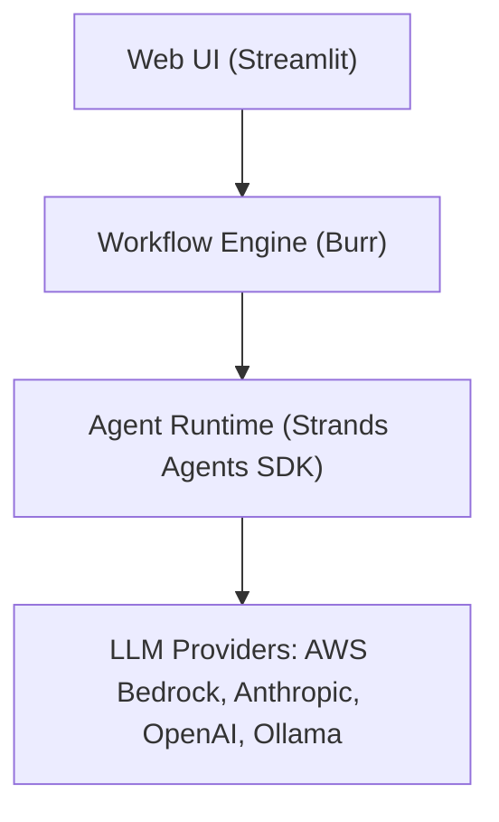

# Technology Stack

This page explains what each technology does, why it was chosen, and where to find its documentation.

## Stack at a Glance

**Also used across the system:** Pydantic (data validation), OpenTelemetry (tracing), Langfuse (LLM cost tracking).

---

## Core Technologies

### Strands Agents SDK

[github.com/strands-agents/sdk-python](https://github.com/strands-agents/sdk-python) | `>=1.25.0`

The framework all 21 agents are built with. Strands is lightweight: an agent is just a prompt, a set of tools, and a model. It doesn't impose heavy abstractions. Haytham chose it because it supports structured output (agents return typed data, not free-form text), tool use (web search, scoring, PDF generation), multi-agent swarms (several agents collaborating on one task), and built-in tracing.

**How Haytham uses it:**

- **Agent creation.** A centralized factory creates agents by name. Each agent has a prompt file, a model tier, and optionally a schema for structured output.
- **Structured output.** Agents that need to return data (scores, competitor lists, story skeletons) declare what shape the response must take. The LLM is constrained to that shape.
- **Tools.** Agents can call tools for web search, scoring, build/buy evaluation, PDF generation, and more.
- **Swarms.** Some tasks (like MVP scoping) use multiple agents that hand off context to each other.
- **Tracing.** Every agent call is automatically instrumented for debugging.

### Burr

[github.com/dagworks-inc/burr](https://github.com/dagworks-inc/burr) | `>=0.40.2`

The workflow engine that runs the four phases. Haytham needs three things from a workflow engine: conditional branching (the pivot strategy only runs when risk is HIGH), checkpoint persistence (if the process is interrupted, it resumes where it left off), and a tracking UI for debugging. Burr provides all three. Unlike Airflow or Dagster, it's designed for application-level workflows rather than data pipelines.

**How Haytham uses it:**

- **Workflow definition.** The four-phase pipeline is defined as a series of stages with transitions between them.
- **Conditional branching.** Some stages only run under certain conditions (e.g., pivot strategy when risk is HIGH).
- **Progress reporting.** Hooks report each stage's progress to the web UI.
- **Tracking UI.** An optional dashboard at `http://localhost:7241` shows every state transition.
- **Checkpoint persistence.** Progress is saved after every stage so the process can resume from any point.

### Pydantic

[docs.pydantic.dev](https://docs.pydantic.dev/) | `>=2.0.0`

Defines and validates the structure of agent outputs. LLMs can return malformed data: missing fields, wrong types, invalid JSON. Pydantic schemas catch these problems immediately. Haytham has 53+ schemas covering everything from validation scores to competitor analyses to story skeletons. Each schema also handles conversion to JSON (for saving) and markdown (for human review).

### Streamlit

[docs.streamlit.io](https://docs.streamlit.io/) | `>=1.52.2`

The web UI. Haytham's interface needs are straightforward: forms for entering ideas, progress indicators for stages, expandable sections for reviewing outputs, and approval gates between phases. Streamlit handles all of this with pure Python and no frontend build step. The main dashboard shows the overall workflow, with separate pages for each phase.

---

## LLM Providers

Haytham supports four LLM providers. Switch between them by setting `LLM_PROVIDER` in `.env`. Each provider maps to three model tiers (REASONING, HEAVY, LIGHT) so you can assign different models to different kinds of work.

| Provider | Status | Notes |
|---|---|---|
| **AWS Bedrock** | Tested | The only fully tested provider. Uses Anthropic Claude models via AWS. |
| **Anthropic** | Supported | Direct API access. Easiest to set up (just an API key). |
| **OpenAI** | Supported | Direct API access. |
| **Ollama** | Supported | Free, local inference. No API key needed. Quality depends on model size. |

See [Getting Started](getting-started.md#provider-setup) for configuration.

---

## Observability

All observability is optional and disabled by default. No data is collected unless you opt in.

### OpenTelemetry

[opentelemetry.io](https://opentelemetry.io/)

The industry standard for tracing. When enabled, Haytham records the full execution path: which stages ran, which agents were called, how long each LLM call took, and where errors occurred. Strands automatically instruments agent and LLM calls; Haytham adds workflow-level and stage-level tracing on top. Traces can be sent to Jaeger, printed to the console, or disabled entirely.

### Langfuse

[langfuse.com/docs](https://langfuse.com/docs)

LLM-specific analytics: which models cost the most, how many tokens each agent uses, and how users rate the outputs. Complementary to OpenTelemetry. Jaeger shows timing and errors; Langfuse shows cost and quality.

### Jaeger

[jaegertracing.io](https://www.jaegertracing.io/)

A tracing UI for visualizing the full execution pipeline. Haytham ships a pre-configured Docker setup. See [Troubleshooting: Tracing with Jaeger](troubleshooting.md#tracing-with-jaeger) for setup.

---

## Supporting Technologies

### Web Search

Agents that need real-time information (market research, competitor analysis) search the web. Three providers are supported in a fallback chain: if one fails or is rate-limited, the next is tried automatically.

1. **DuckDuckGo.** Free, no API key, used by default.
2. **Brave Search.** Requires an API key, higher quality results.
3. **Tavily.** Requires an API key, alternative provider.

A session-wide limit (default: 20 searches across the entire pipeline) prevents runaway costs.

### ReportLab (PDF Generation)

[docs.reportlab.com](https://docs.reportlab.com/)

Generates styled PDF reports from workflow outputs. Optional.

### LanceDB (Vector Storage)

[lancedb.github.io/lancedb](https://lancedb.github.io/lancedb/)

An embedded vector database that runs locally with no server. Stores capabilities, architecture decisions, and domain entities so agents can search for relevant context from earlier stages.

---

## Version Pinning

Several of these technologies are rapidly evolving. The `pyproject.toml` pins minimum tested versions:

| Package | Minimum | Notes |
|---|---|---|
| `strands-agents` | `1.25.0` | Breaking changes between minor versions are possible |
| `burr` | `0.40.2` | Pre-1.0; API may change |
| `bedrock-agentcore` | `1.0.0` | Recently released |
| `pydantic` | `2.0.0` | Stable; v2 required (not v1) |
| `streamlit` | `1.52.2` | Stable |

When upgrading, run `pytest tests/ -v -m "not integration"` before committing.
